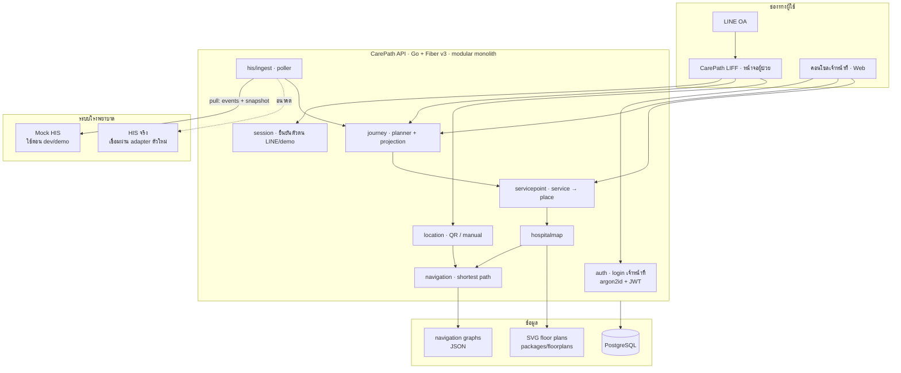
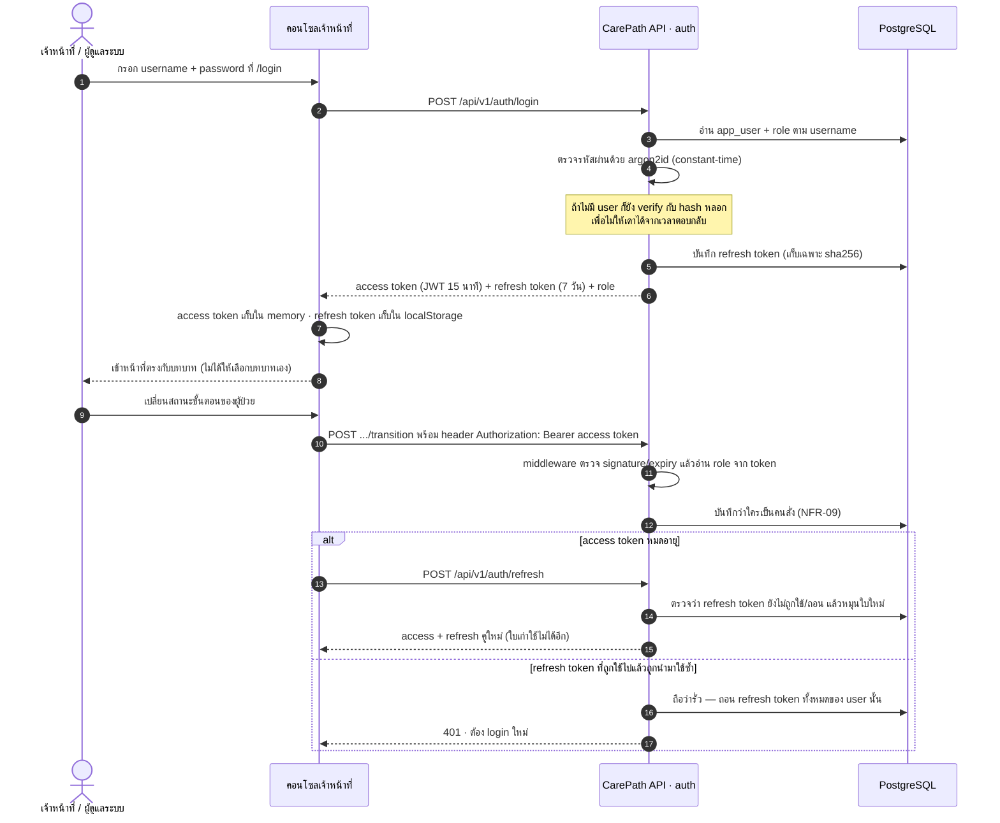
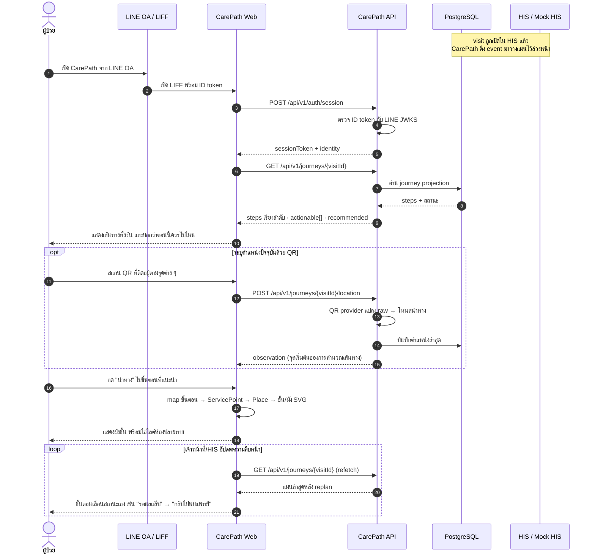
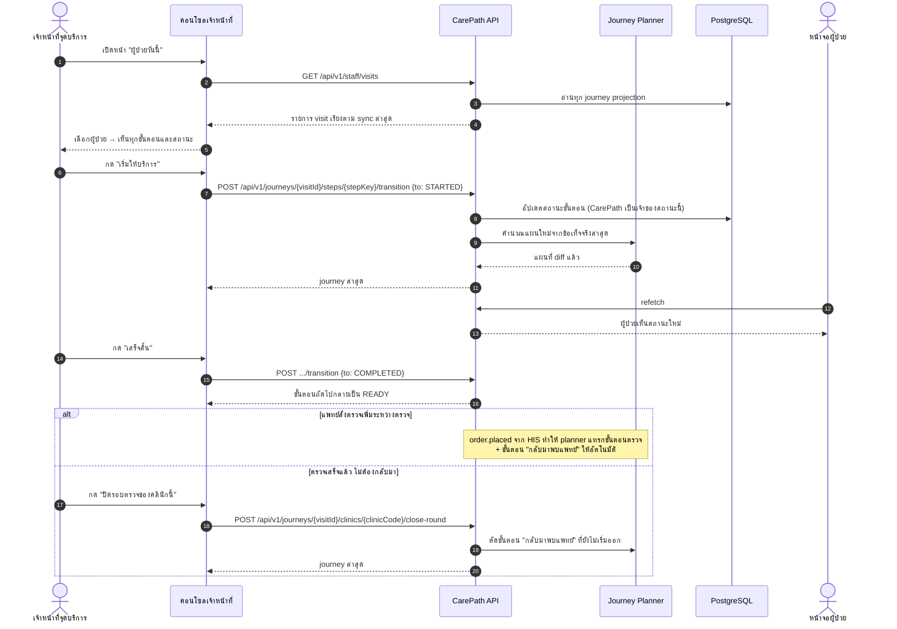
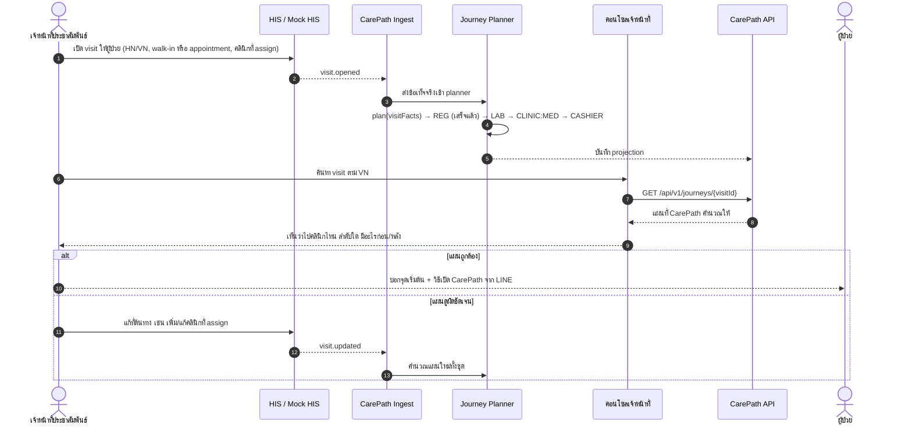
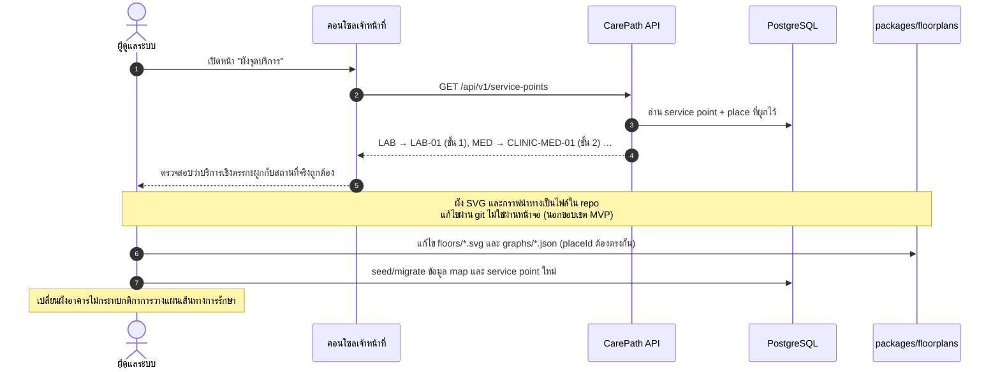
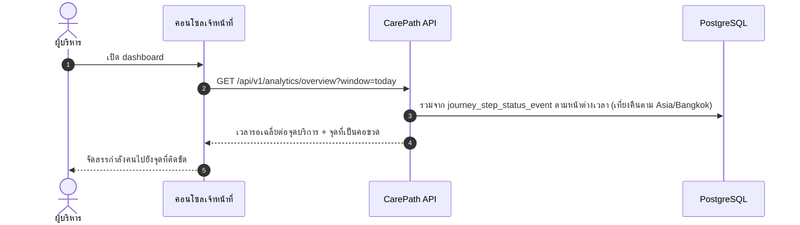
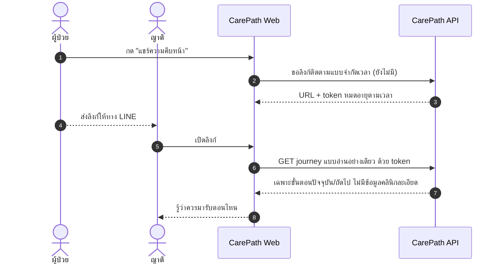
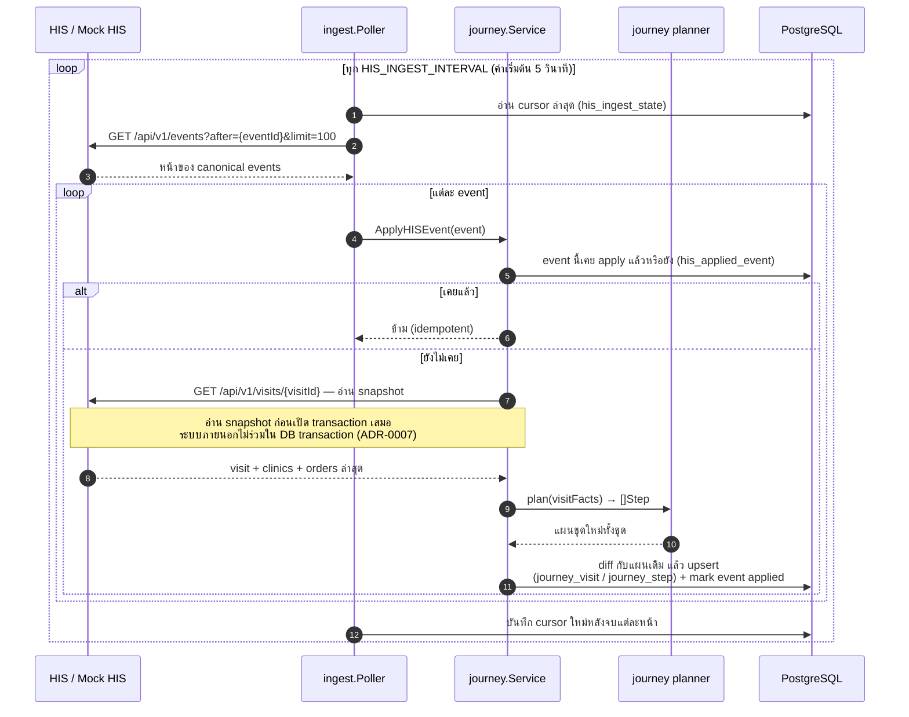

# CarePath

> แพลตฟอร์ม **เส้นทางผู้ป่วย (Patient Journey)** และ **นำทางภายในอาคาร (Indoor Navigation)** สำหรับโรงพยาบาล ทำงานอยู่ *เหนือ* ระบบ HIS โดยไม่แตะฐานข้อมูล HIS โดยตรง

ผู้ป่วยนอกที่มาโรงพยาบาลมักไม่รู้ว่า **ตอนนี้ต้องทำอะไร** **ขั้นตอนถัดไปอยู่ที่ไหน** และ **เดินไปยังไง** ข้อมูลเหล่านี้กระจายอยู่ในใบนัด ป้ายบอกทาง และเจ้าหน้าที่ CarePath รวบข้อมูลเชิงคลินิกจาก HIS เข้ากับข้อมูลเชิงพื้นที่ของโรงพยาบาล แล้วแปลงเป็นเส้นทางเดียวที่ผู้ป่วยเปิดดูได้จาก LINE

โครงการนี้เริ่มจาก Hackathon MVP — ให้ความสำคัญกับ **ส่วนที่ใช้งานได้จริงทีละชิ้นเล็ก ๆ** มากกว่าสถาปัตยกรรมที่ออกแบบล่วงหน้าเกินจำเป็น

---

## สารบัญ

- [CarePath ทำอะไร](#carepath-ทำอะไร)
- [แนวคิดหลัก](#แนวคิดหลัก)
- [ภาพรวมสถาปัตยกรรม](#ภาพรวมสถาปัตยกรรม)
- [User Journey แยกตามบทบาท](#user-journey-แยกตามบทบาท)
  - [0. การเข้าสู่ระบบของเจ้าหน้าที่](#0-การเข้าสู่ระบบของเจ้าหน้าที่-staff--admin)
  - [1. ผู้ป่วย](#1-ผู้ป่วย-patient)
  - [2. เจ้าหน้าที่จุดบริการ](#2-เจ้าหน้าที่จุดบริการ-service-point-staff)
  - [3. เจ้าหน้าที่ประชาสัมพันธ์ / คัดกรอง](#3-เจ้าหน้าที่ประชาสัมพันธ์--คัดกรอง-registration-staff)
  - [4. ผู้ดูแลระบบ](#4-ผู้ดูแลระบบ-hospital-admin)
  - [5. ผู้บริหารโรงพยาบาล](#5-ผู้บริหารโรงพยาบาล-executive)
  - [6. ญาติผู้ป่วย](#6-ญาติผู้ป่วย-relative)
- [การเชื่อมต่อกับ HIS](#การเชื่อมต่อกับ-his)
- [เริ่มต้นใช้งาน](#เริ่มต้นใช้งาน)
  - [URL แยกตามบทบาท (ผู้ป่วย vs เจ้าหน้าที่)](#url-แยกตามบทบาท-ผู้ป่วย-vs-เจ้าหน้าที่)
- [คำสั่งที่ใช้บ่อย](#คำสั่งที่ใช้บ่อย)
- [โครงสร้าง Repository](#โครงสร้าง-repository)
- [สถานะการพัฒนา](#สถานะการพัฒนา)
- [ขอบเขตสถาปัตยกรรมที่ห้ามละเมิด](#ขอบเขตสถาปัตยกรรมที่ห้ามละเมิด)
- [เอกสารเพิ่มเติม](#เอกสารเพิ่มเติม)

---

## CarePath ทำอะไร

**ทำ**

- รับ "ข้อเท็จจริงเชิงคลินิก" จาก HIS (เปิด visit, สั่ง order, ตรวจเสร็จ) แล้ว **คำนวณแผนการเดินทางของผู้ป่วยเอง** — มีขั้นตอนอะไรบ้าง เรียงอย่างไร สถานะเป็นอย่างไร
- ผูกขั้นตอนเชิงบริการ (LAB, CLINIC, CASHIER, PHARMACY) เข้ากับ **สถานที่จริง** ในโรงพยาบาล
- แสดงแผนผังชั้นและตำแหน่งปลายทาง พร้อมคำนวณเส้นทางจากกราฟนำทาง
- ระบุตำแหน่งปัจจุบันของผู้ป่วยผ่าน **QR** (baseline) หรือแหล่งอื่นผ่าน provider เดียวกัน
- ให้เจ้าหน้าที่จุดบริการสั่งเปลี่ยนสถานะขั้นตอนของผู้ป่วยได้

**ไม่ทำ**

- ไม่แทนที่ HIS และไม่อ่าน/เขียนฐานข้อมูล HIS โดยตรง
- ไม่เป็นเจ้าของข้อมูลเชิงคลินิก (visit, order, ผลตรวจ) — HIS ยังเป็น system of record
- ไม่ทำ 3D floor plan และไม่ต้องพึ่ง Zigbee ระดับ production ใน MVP

---

## แนวคิดหลัก

โมเดลความคิดของทั้งระบบสรุปได้เป็น 7 ชิ้น แต่ละชิ้นรู้เรื่องเดียวและไม่ก้าวก่ายกัน

| ชิ้นส่วน | รู้อะไร |
|---|---|
| **HIS** | ผู้ป่วยต้องรับบริการอะไร (visit, คลินิกที่ assign, order, ผลตรวจ) |
| **Care Graph / Journey Planner** | ขั้นตอนถัดไปคืออะไร และเรียงลำดับอย่างไร |
| **ServicePoint** | ขั้นตอนเชิงบริการนี้ ผูกกับจุดบริการทางกายภาพใด |
| **Hospital Map** | จุดบริการนั้นอยู่ตรงไหน (อาคาร / ชั้น / โซน / ห้อง) |
| **Navigation Graph** | เดินจากจุด A ไปจุด B อย่างไร |
| **Location Provider** | ตอนนี้ผู้ป่วยอยู่ที่ไหน (QR / Zigbee / เลือกเอง) |
| **LINE LIFF / Web** | นำเสนอเส้นทางและการนำทางให้ผู้ป่วย |

> **หลักการสำคัญ:** ขั้นตอนการรักษา (care step) ต้องไม่เก็บพิกัดหรือเส้นทางไว้ในตัวเอง — มันอ้างถึง `ServicePoint` → `Place` → โหนดในกราฟนำทาง ทำให้ "ผังอาคารเปลี่ยน" กับ "ขั้นตอนบริการเปลี่ยน" แก้คนละที่ ([ADR-0002](docs/adr/0002-separate-care-and-navigation-graphs.md))

---

## ภาพรวมสถาปัตยกรรม



| Service | เทคโนโลยี | พอร์ต | หน้าที่ |
|---|---|---|---|
| `apps/web` | React + TypeScript + Vite + TanStack Router/Query | `5173` | หน้าจอผู้ป่วย (LIFF) และคอนโซลเจ้าหน้าที่ |
| `apps/api` | Go + Fiber v3 | `8080` | CarePath API — journey planner, service point, navigation, location, session ผู้ป่วย, auth เจ้าหน้าที่ |
| `apps/mock-his` | Go + Fiber v3 | `8090` | HIS จำลอง + คอนโซลขับ demo (`/console`) |
| `postgres` | PostgreSQL 17 | `5432` | projection ของ journey, service point, map, location |

---

## User Journey แยกตามบทบาท

| บทบาท | เข้าระบบทาง | ทำอะไรได้ | สถานะ |
|---|---|---|---|
| เจ้าหน้าที่ทุกบทบาท + ผู้ดูแลระบบ | หน้า `/login` ด้วย username + password | เข้าคอนโซลเจ้าหน้าที่ตามสิทธิ์ของบทบาท (`STAFF` / `ADMIN`) | ใช้งานได้จริง ([ADR-0010](docs/adr/0010-staff-auth-jwt-argon2.md) · บัญชีสาธิต `admin/demo`, `staff/demo`) |
| ผู้ป่วย | LINE OA → LIFF | ดูเส้นทางทั้งวัน, ดูขั้นตอนถัดไป, นำทางไปจุดบริการ, สแกน QR ระบุตำแหน่ง, เห็นสถานะใหม่อัตโนมัติเมื่อเจ้าหน้าที่ปิดขั้นตอน | ใช้งานได้จริง (ยกเว้น QR ใน UI) |
| เจ้าหน้าที่จุดบริการ | คอนโซลเจ้าหน้าที่ | ดูผู้ป่วยวันนี้, เปลี่ยนสถานะขั้นตอน, ปิดรอบตรวจของคลินิก | ใช้งานได้จริง (เรียกคิวยังเป็นหน้าจอ demo) |
| เจ้าหน้าที่ประชาสัมพันธ์ / คัดกรอง | คอนโซลเจ้าหน้าที่ | ค้น visit แล้วดูแผนที่ CarePath คำนวณให้ | ใช้งานได้จริง |
| ผู้ดูแลระบบ | คอนโซลเจ้าหน้าที่ | ดู mapping จุดบริการ ↔ สถานที่, ผังอาคาร, กติกาการวางแผน | อ่านได้ · หน้าจอแก้ไขยังไม่อยู่ใน MVP |
| ผู้บริหาร | คอนโซลเจ้าหน้าที่ | ดูภาพรวมวันนี้: จุดที่รอมากสุด, เวลารอเฉลี่ย, รอนานสุดตอนนี้, ภาระต่อจุดบริการ | ใช้งานได้จริง (บัญชีสาธิต `exec/demo` เห็นเฉพาะหน้าภาพรวม) |
| ญาติผู้ป่วย | ลิงก์จำกัดเวลา | ติดตามว่าผู้ป่วยอยู่ขั้นตอนไหน | ออกแบบไว้ · ยังไม่พัฒนา |

### 0. การเข้าสู่ระบบของเจ้าหน้าที่ (Staff / Admin)

> **ใช้งานได้จริง** — รายละเอียดการออกแบบอยู่ใน [ADR-0010](docs/adr/0010-staff-auth-jwt-argon2.md) และ contract ใน `packages/contracts/openapi/carepath.yaml` · บัญชีสาธิตจาก migration: `admin/demo` (ADMIN), `staff/demo` (STAFF)

ผู้ป่วยเข้าระบบผ่าน LINE (`session`) ส่วนเจ้าหน้าที่เข้าด้วย username/password ที่โรงพยาบาลออกให้ (`auth`) — **แยกกันคนละกลไก** เพราะพยาบาลที่จุดบริการไม่มี LINE identity มายืนยัน และผู้ป่วยไม่มีรหัสผ่านในระบบ CarePath



| สิ่งที่ต้องรู้ | ค่า |
|---|---|
| บัญชี demo | `admin` / `demo` (ADMIN) · `staff` / `demo` (STAFF) · `exec` / `demo` (EXECUTIVE — เข้าได้เฉพาะ analytics, #86) — **รหัสผ่านสาธิตเท่านั้น** hash อยู่ใน migration ที่เปิดสาธารณะ |
| อายุ token | access 15 นาที (`ACCESS_TOKEN_TTL`) · refresh 7 วัน (`REFRESH_TOKEN_TTL`) |
| คีย์เซ็น JWT | `JWT_SECRET` — ถ้าไม่ตั้ง API จะสุ่มคีย์ใหม่ทุกครั้งที่บูตพร้อม log warning (token เดิมใช้ไม่ได้หลัง restart) |
| endpoint ที่ต้องมี token | `GET /api/v1/staff/visits` · `POST .../steps/{stepKey}/transition` · `POST .../clinics/{clinicCode}/close-round` · `GET /api/v1/auth/me` · `GET /api/v1/analytics/overview` (`STAFF`/`ADMIN`/`EXECUTIVE`, #86) |
| ยังเปิดอยู่โดยตั้งใจ | `GET /api/v1/journeys/{visitId}`, service point, location, route — หน้าจอผู้ป่วยใช้ endpoint เดียวกัน การผูก journey กับ session ของผู้ป่วยเองเป็นงานอีกก้อน (ADR-0010 §7) |

### 1. ผู้ป่วย (Patient)

เส้นทางหลักของระบบ: เปิดจาก LINE → เห็นทั้งวันของตัวเอง → กดนำทางไปขั้นตอนถัดไป



**หมายเหตุสถานะ:** หน้าเส้นทางและหน้านำทางอ่านข้อมูลจริงจาก API แล้ว · endpoint QR (`POST/GET /journeys/{visitId}/location`) ทำงานฝั่ง API แล้วแต่ยังไม่ผูกกับ UI (หน้าจอยังให้สแกน QR แบบ manual instruction ไม่มีกล้องสแกนจริง) · เส้นทางแบบลากเส้น + คำบอกทางทีละก้าว **ทำงานแล้วครบวงจร** ผ่าน `GET /api/v1/navigation/route` — มี handler จริง (`apps/api/internal/navigation`) ต่อเข้า router แล้ว และหน้า `/patient/navigate` เรียกใช้เพื่อวาดเส้นทางบนผัง SVG พร้อมคำบอกทางเป็นข้อความ

### 2. เจ้าหน้าที่จุดบริการ (Service-Point Staff)

เจ้าหน้าที่ห้องตรวจ / แล็บ / X-ray / ห้องยา เป็นคนขยับสถานะขั้นตอนของผู้ป่วย ซึ่งจะสะท้อนกลับไปที่หน้าจอผู้ป่วยทันที



> `close-round` คือทางออกเมื่อ "การเดาของ planner ผิด" และเป็น fallback เมื่อ HIS จริงส่ง `encounter.completed` ไม่ได้ ([ADR-0009 §4](docs/adr/0009-carepath-owns-journey-plan.md))

**หมายเหตุสถานะ:** หน้า "ผู้ป่วยวันนี้" และปุ่มเปลี่ยนสถานะทำงานกับ API จริง · หน้า "เรียกคิว" ยังเป็นหน้าจอ demo เพราะยังไม่มี queue endpoint

### 3. เจ้าหน้าที่ประชาสัมพันธ์ / คัดกรอง (Registration Staff)

การเปิด visit และสั่ง order เกิดใน **HIS** ไม่ใช่ใน CarePath — เจ้าหน้าที่จุดนี้ใช้ CarePath เพื่อ *ตรวจทาน* แผนที่ระบบคำนวณให้ ก่อนส่งผู้ป่วยออกเดิน



> จุดสำคัญ: **แก้ที่ HIS เสมอ** ไม่ใช่แก้ที่ CarePath — เพราะ planner คำนวณใหม่ทุกครั้งที่มี fact เข้ามา การแก้ข้อมูลใน CarePath จะถูกเขียนทับ

### 4. ผู้ดูแลระบบ (Hospital Admin)



**หมายเหตุสถานะ:** หน้า "ผังจุดบริการ" อ่านข้อมูลจริง · หน้า "ผังอาคาร" ยังเป็น placeholder · หน้าจอ CRUD ผังอาคารอยู่นอกขอบเขต MVP โดยตั้งใจ · RBAC ใช้งานได้จริงตาม [ADR-0010](docs/adr/0010-staff-auth-jwt-argon2.md) (argon2id + JWT, บทบาท `STAFF`/`ADMIN`) — หน้า `/login` ยืนยันตัวตนกับ API จริง และ API ของเจ้าหน้าที่ (monitor, transition, close-round) ต้องแนบ access token ส่วนหน้าจอจัดการผู้ใช้ไม่อยู่ใน MVP (บัญชีสร้างจาก migration แล้วแก้ที่ฐานข้อมูล)

### 5. ผู้บริหารโรงพยาบาล (Executive)

> **ใช้งานได้จริง** — อยู่ในกลุ่ม Should Have (S7) ของ MVP scope · บัญชีสาธิต `exec/demo` (EXECUTIVE) เห็นเฉพาะหน้า "ภาพรวม" ในคอนโซล



ข้อมูลดิบที่ dashboard ต้องใช้ถูกเก็บอยู่ในตาราง `carepath.journey_step_status_event` (#85) — timeline แบบ append-only ที่บันทึกทุกการเปลี่ยนสถานะของ step พร้อมเวลา (`occurred_at`) ทั้งที่ planner เป็นคนขยับ (เช่น `PENDING→WAITING→READY`) และที่เจ้าหน้าที่สั่ง ส่วน `carepath.journey_step` เก็บเฉพาะสถานะปัจจุบันเท่านั้น (replan ลบแล้วสร้างใหม่ทุกรอบ จึงใช้ย้อนอดีตไม่ได้)

ชั้น aggregate พร้อมแล้วในโมดูล `internal/analytics` (#86): `GET /api/v1/analytics/overview?window=today` คืนตัวเลขต่อจุดบริการ (กำลังรอ/กำลังให้บริการ, รอนานสุดตอนนี้, เวลารอเฉลี่ย, เวลาให้บริการเฉลี่ย, จำนวนที่เสร็จในวันนี้) และภาพรวม visit พร้อมจุดคอขวด — ค่าที่ยังไม่มีข้อมูลเป็น `null` (ไม่ใช่ 0) และไม่มีข้อมูลระดับผู้ป่วยเด็ดขาด (NFR-03) บทบาท `EXECUTIVE` (บัญชีสาธิต `exec/demo`) เข้าถึง endpoint นี้ได้เท่านั้น — ยิง API กลุ่มเจ้าหน้าที่อื่นจะได้ 403 ตาม ADR-0010 หน้า "ภาพรวม" ในคอนโซล (#87) ดึงข้อมูลนี้แบบ polling ทุก 15 วินาที และแสดงค่าที่ยังไม่มีข้อมูลเป็นขีด (—) ไม่ใช่ 0 สิ่งที่เหลือคือข้อมูลย้อนหลังสำหรับ demo (#88)

### 6. ญาติผู้ป่วย (Relative)

> **ออกแบบไว้ · ยังไม่พัฒนา** — อยู่ในกลุ่ม Could Have (C2)



---

## การเชื่อมต่อกับ HIS

ส่วนนี้คือหัวใจของระบบ และเป็นจุดที่ออกแบบใหม่ใน [ADR-0009](docs/adr/0009-carepath-owns-journey-plan.md)

### ข้อค้นพบที่เปลี่ยนการออกแบบ

**HIS ไม่มีแนวคิดเรื่อง "ลำดับขั้นตอนของผู้ป่วย"** สิ่งที่ HIS รู้และส่งออกมาได้มีแค่ข้อเท็จจริงเชิงคลินิก — เปิด visit, ผู้ป่วยถูก assign คลินิกไหน, มี order อะไร, order ถูกทำแล้ว/ออกผลแล้ว, แพทย์ตรวจเสร็จแล้ว

ดังนั้น **CarePath ต้องคำนวณเส้นทางเอง** ไม่ใช่ขอรายการขั้นตอนจาก HIS

### ใครเป็นเจ้าของอะไร

| ข้อมูล | เจ้าของ |
|---|---|
| visit, การ assign คลินิก, order, ผลตรวจ, การจบ encounter | **HIS** (system of record) |
| แผนการเดินทาง: มีขั้นตอนอะไร เรียงอย่างไร สถานะอะไร | **CarePath** |
| การผูกจุดบริการกับสถานที่ และการนำทาง | **CarePath** |

CarePath **ไม่เคยเขียนสถานะขั้นตอนกลับไปที่ HIS** เพราะ "ขั้นตอน" เป็นแนวคิดของ CarePath ล้วน ๆ และส่วนใหญ่ไม่มีคู่ตรงในฝั่ง HIS

### Canonical events (HIS → CarePath)

Adapter ของ HIS จริงมีหน้าที่ map สิ่งที่ตัวเองมีมาเป็น 8 ข้อเท็จจริงนี้ ไม่ต้องเข้าใจเรื่อง journey เลย

| Event | ความหมาย | payload หลัก |
|---|---|---|
| `visit.opened` | เปิด visit = ลงทะเบียนเสร็จ | `patientRef`, `patientName`, `visitType`, `clinics[]` |
| `visit.updated` | คลินิก/สถานะ visit เปลี่ยน | `clinics[]`, `status` |
| `visit.closed` | ปิด visit | `status` |
| `order.placed` | มีคำสั่งตรวจ/สั่งยา | `orderRef`, `orderType`, `orderName`, `orderedByClinic` |
| `order.performed` | ทำหัตถการแล้ว (เจาะเลือด/ถ่ายฟิล์ม) | `orderRef`, `performedAt` |
| `order.resulted` | ผลออกแล้ว แพทย์อ่านได้ | `orderRef`, `resultedAt` |
| `order.cancelled` | ยกเลิก order | `orderRef` |
| `encounter.completed` | แพทย์คลินิกนี้ตรวจเสร็จรอบนี้แล้ว | `clinicCode`, `completedAt` |

ทุก event ใช้ envelope เดียวกัน (`eventId`, `occurredAt`, `visitId`, `patientRef`, `type`, `payload`) โดย `eventId` เป็นกุญแจกัน event ซ้ำฝั่ง consumer

### กลไก Ingest → Replan

MVP ใช้ REST pull ([ADR-0006](docs/adr/0006-rest-openapi.md)) ถ้าจะเปลี่ยนเป็น webhook/message queue ในอนาคต แก้แค่ package `internal/his/ingest` โดยไม่แตะโดเมน journey



จุดที่ทำให้กลไกนี้ทนต่อความผิดพลาด:

- **คำนวณใหม่ทั้งชุด ไม่ append** — `plan(visitFacts) -> []Step` เป็นฟังก์ชันบริสุทธิ์ ทดสอบได้โดยไม่ต้องมี DB หรือ HIS
- **diff ไม่ทับประวัติ** — ขั้นตอนที่ `COMPLETED` / `STARTED` / `CANCELLED` ถือเป็นประวัติ ห้ามลบหรือสลับที่ ถอนได้เฉพาะขั้นตอนที่ยัง `PENDING` / `WAITING`
- **stepKey คงที่** — `CLINIC:MED:2`, `LAB:ORD-118`, `CASHIER` เป็นตัวระบุขั้นตอน ส่วน `sequence` เป็นแค่ลำดับการแสดงผล
- **cursor ทนพัง** — บันทึกหลังจบแต่ละหน้า ถ้า apply ล้มกลางหน้า รอบถัดไปจะ retry ตั้งแต่ event ที่ล้ม ส่วน envelope ที่ผิดรูปจะถูกข้ามพร้อม log ไม่ให้ค้างทั้ง feed

### กติกาที่ planner ใช้เรียงลำดับ

เรียงด้วยคีย์ `(clinicIndex, phase, orderedAt)`

| phase | ขั้นตอน | เกิดขึ้นเมื่อ |
|---|---|---|
| 0 | `REG` | เสมอ · เป็น `COMPLETED` ตั้งแต่ `visit.opened` (การเปิด visit *คือ* การลงทะเบียน) |
| 10 | 1 ขั้นตอนต่อ order type ที่สั่งก่อนพบแพทย์ | order ที่ `orderedAt <= openedAt` |
| 20 | `CLINIC:<code>#1` | 1 ขั้นตอนต่อคลินิกที่ถูก assign |
| 30 | 1 ขั้นตอนต่อ order type ที่สั่งระหว่างตรวจ | `order.placed` ขณะ encounter ยังเปิด |
| 40 | `CLINIC:<code>#n+1` | กลับมาพบแพทย์คนเดิมหลังตรวจเพิ่ม |
| 90 | `CASHIER` | เสมอ · **ครั้งเดียวต่อ visit** ไม่ว่าจะมีกี่คลินิก |
| 95 | `PHARMACY` | มี order ประเภท `DRUG` |

พฤติกรรมที่ตามมาจากกติกานี้:

- order ประเภทเดียวกันในรอบเดียวกันยุบเป็นขั้นตอนเดียว (แล็บ 5 รายการ = เดินไปแล็บครั้งเดียว)
- order ตรวจวินิจฉัย (`LAB`, `XRAY`, `EKG`, `US`) ที่สั่งระหว่าง encounter **แปลว่าแพทย์ตั้งใจจะอ่านผล** → planner เติมขั้นตอน "กลับมาพบแพทย์" ให้อัตโนมัติ · order ประเภท `DRUG` ไม่เข้าเงื่อนไขนี้
- ขั้นตอนตรวจจบเมื่อ `order.performed` (เจาะเลือดเสร็จก็ออกจากแล็บได้) แต่ขั้นตอน "กลับมาพบแพทย์" จะเป็น `WAITING` จนกว่าทุก order ในรอบนั้นจะ `order.resulted` — ผู้ป่วยจึงเห็นสถานะ "รอผลตรวจ" อย่างตรงไปตรงมา
- ขั้นตอนที่อยู่ phase เดียวกันเป็น `READY` พร้อมกันหมด (มีทั้งแล็บและ X-ray ก่อนพบแพทย์ = ไปอันไหนก่อนก็ได้) API จึงส่ง `actionable[]` มาพร้อมกับ `recommended` หนึ่งรายการ
- สถานะขั้นตอนทั้งหมด: `PENDING | WAITING | READY | STARTED | COMPLETED | CANCELLED`

### การเปลี่ยนไปใช้ HIS จริง

1. เขียน adapter ตัวใหม่ที่ implement HIS port เดียวกับ `internal/his/httpclient` โดย map ข้อมูลของ vendor มาเป็น 8 canonical events ข้างบน
2. ชี้ `HIS_BASE_URL` ไปที่ adapter ตัวใหม่
3. โดเมน journey / navigation **ไม่ต้องแก้แม้แต่บรรทัดเดียว** ([ADR-0005](docs/adr/0005-his-adapter-and-mock-his.md))

`encounter.completed` เป็นสัญญาณที่ HIS แต่ละเจ้าอาจไม่มีตรง ๆ — อาจ map จากการปิด note ของแพทย์ จากสถานะ worklist ของคลินิก หรือให้เจ้าหน้าที่กด `close-round` ใน CarePath แทน

> ข้อมูลเชิงสัญญาที่เป็น source of truth อยู่ที่ [`packages/contracts/openapi/`](packages/contracts/openapi/) — `carepath.yaml` และ `mock-his.yaml`

---

## เริ่มต้นใช้งาน

### วิธีที่ 1: Docker Compose (แนะนำ)

```bash
cp .env.example .env
docker compose up --build     # หรือ: make up
```

| บริการ | URL |
|---|---|
| CarePath Web | http://localhost:5173 |
| CarePath API | http://localhost:8080 |
| Swagger UI | http://localhost:8080/swagger |
| Mock HIS console | http://localhost:8090/console |
| PostgreSQL | localhost:5432 |

migration ของฐานข้อมูลรันอัตโนมัติผ่าน service `migrate` (golang-migrate) ก่อน API จะสตาร์ต

หน้าเว็บคุยกับ API แบบ same-origin ผ่าน `/api` (dev: Vite proxy ส่งต่อให้, ดู `apps/web/vite.config.ts`) — ทดสอบบนมือถือจึง tunnel แค่ port เดียว ถ้าจะชี้ไปที่ origin อื่นตั้ง `VITE_API_BASE_URL` ได้ตามปกติ

### รูปแบบ production (single origin)

```bash
docker compose -f docker-compose.prod.yml up --build -d
```

ต่างจาก dev compose ตรงที่**เปิด port ออกแค่ service `proxy`** ตัวเดียว (`CAREPATH_EDGE_PORT`, default 80) — ทุกอย่างที่เบราว์เซอร์ต้องการอยู่บน origin เดียวกันหมด:

| เส้นทางบน edge | ไปที่ |
|---|---|
| `/` | web (static build ของ SPA) |
| `/api/…` | CarePath API |
| `/console`, `/api/v1/demo/visits|orders…`, `/api/v1/events` | Mock HIS (console ของคนดำเนินการ) |

การแยกเส้นทางอยู่ใน `infra/docker/proxy.conf` — path ฝั่ง demo ของ Mock HIS ไม่ชนกับของ API (ตัวเดียวที่ API มีคือ `/api/v1/demo/zigbee`) ส่วน PostgreSQL, API, Mock HIS และ web ไม่เปิดออกนอก docker network ทั้งหมด

ถ้าจะชี้ LIFF endpoint มาที่ stack นี้ ต้องมี TLS ครอบหน้า edge ก่อน (LIFF รับเฉพาะ HTTPS นอกจาก localhost)

### วิธีที่ 2: รันแยกทีละตัว

```bash
go work sync

make mock-his   # :8090
make api        # :8080  (ต้องมี postgres + migrate แล้ว: make migrate-up)
make web        # :5173
```

หรือรันทั้งหมดเป็น background process พร้อมกัน: `make start` / `make stop` (log อยู่ใน `logs/`)

### เดินดูระบบด้วย demo visit

ระบบมาพร้อม visit ตัวอย่าง 2 แบบ ซึ่ง seed ฝังอยู่ใน Mock HIS (รันใหม่ทุกครั้งที่ restart ได้ผลเหมือนเดิมเสมอ):

| Seed | ผู้ป่วย | สถานะตอน boot | แผนที่ planner สรุปให้ |
|---|---|---|---|
| `VISIT-001` | สมชาย ใจดี (`PATIENT-DEMO-001`) · appointment | มี order LAB "CBC" สั่งก่อนมาถึง | `REG` (เสร็จแล้ว) → `LAB` → `CLINIC:MED` → `CASHIER` |
| `VISIT-002` | สมหญิง รักษ์ดี (`PATIENT-DEMO-002`) · walk-in | หมอสั่ง X-ray ระหว่างตรวจแล้ว (order `ORD-002`) | `REG` (เสร็จแล้ว) → `CLINIC:MED` → `XRAY` → … |

**`VISIT-002` คือ demo happy path เต็มรูปแบบ** — ขั้นที่เหลือจะถูกเติมเข้ามาเองเมื่อเดินเรื่องผ่าน [Mock HIS console](http://localhost:8090/console) (หรือ demo API):

1. เจ้าหน้าที่กด "เริ่ม" ขั้นพบแพทย์จากคอนโซลเจ้าหน้าที่ CarePath → planner เติมขั้น "กลับมาพบแพทย์" (`CLINIC:MED:2`) เข้าแผนทันที
2. รับซองฟิล์ม: กด performed + resulted สำหรับ `ORD-002` ที่ console → ขั้นเอกซเรย์เสร็จ ขั้นกลับมาพบแพทย์พร้อมทันที
3. แพทย์จ่ายยา: วาง order `DRUG` จากคลินิก MED → ขั้นรับยา (`PHARMACY`) ปรากฏท้ายแผน
4. ปิด encounter ของ MED → ขั้นชำระเงิน (`CASHIER`) พร้อม เก็บเงินเสร็จ → ขั้นรับยาพร้อม จบการเยี่ยม

identifier ทั้งหมดคงที่ทุกครั้งที่ reset (`VISIT-002` / `PATIENT-DEMO-002` / `ORD-002` / ลำดับ order ถัดไปคือ `ORD-003`) จึงใช้เขียน E2E และ demo script ได้

```bash
# 1. ดูเส้นทางที่ CarePath คำนวณให้
curl -s localhost:8080/api/v1/journeys/VISIT-002 | jq

# 2. จำลองว่าแพทย์สั่งตรวจเพิ่มระหว่างตรวจ (จาก Mock HIS)
curl -s -X POST localhost:8090/api/v1/demo/visits/VISIT-001/orders \
  -H 'Content-Type: application/json' \
  -d '{"orderType":"XRAY","orderName":"Chest PA","orderedByClinic":"MED"}' | jq

# 3. รออย่างน้อย HIS_INGEST_INTERVAL แล้วดูแผนอีกครั้ง
#    จะเห็นขั้นตอน X-ray + ขั้นตอน "กลับมาพบแพทย์" ถูกเติมเข้ามาเอง
curl -s localhost:8080/api/v1/journeys/VISIT-001 | jq '.steps[] | {stepKey, status}'
```

หน้า **Mock HIS console** (http://localhost:8090/console) ทำแบบเดียวกันได้ผ่าน UI: เปิด visit, สั่ง order, กด performed / resulted, ปิด encounter, ปิด visit
**ประวัติย้อนหลังเพื่อ dashboard ผู้บริหาร (#88)** — นอกจาก visit สาธิต 2 คนข้างบน ฐานข้อมูลที่ reset มาพร้อม visit `VISIT-H-001` … `VISIT-H-009` (ชื่อขึ้นต้น "สาธิต" ทั้งหมด) ที่จบไปแล้วในวันเดียวกัน เพื่อให้ [ภาพรวมของผู้บริหาร](#5-ผู้บริหารโรงพยาบาล-executive) มีเวลารอเฉลี่ยและคอขวดให้ดูทันทีโดยไม่ต้องอัด event เองก่อนสาธิต ชุดข้อมูลนี้เขียนลง projection ตรง ๆ ผ่าน migration `000016_seed_demo_history` (เวลาเป็น offset จาก `now()` ย้อนหลัง ~4 ชั่วโมง บีบไม่ให้ข้ามเที่ยงคืน) — เป็นข้อมูลสาธิตล้วน ไม่มี HIS event อ้างถึง และห้ามใช้วิธีนี้กับข้อมูลจริง visit เหล่านี้จะโผล่ในหน้า "ผู้ป่วยวันนี้" ของเจ้าหน้าที่ด้วย (สถานะ COMPLETED ทั้งหมด ไม่มีปุ่มให้กด) ซึ่งตั้งใจให้คอนโซลดูมีชีวิตขึ้น


**ประวัติย้อนหลังเพื่อ dashboard ผู้บริหาร (#88)** — นอกจาก visit สาธิต 2 คนข้างบน ฐานข้อมูลที่ reset มาพร้อม visit `VISIT-H-001` … `VISIT-H-009` (ชื่อขึ้นต้น "สาธิต" ทั้งหมด) ที่จบไปแล้วในวันเดียวกัน เพื่อให้ [ภาพรวมของผู้บริหาร](#5-ผู้บริหารโรงพยาบาล-executive) มีเวลารอเฉลี่ยและคอขวดให้ดูทันทีโดยไม่ต้องอัด event เองก่อนสาธิต ชุดข้อมูลนี้เขียนลง projection ตรง ๆ ผ่าน migration `000016_seed_demo_history` (เวลาเป็น offset จาก `now()` ย้อนหลัง ~4 ชั่วโมง บีบไม่ให้ข้ามเที่ยงคืน) — เป็นข้อมูลสาธิตล้วน ไม่มี HIS event อ้างถึง และห้ามใช้วิธีนี้กับข้อมูลจริง visit เหล่านี้จะโผล่ในหน้า "ผู้ป่วยวันนี้" ของเจ้าหน้าที่ด้วย (สถานะ COMPLETED ทั้งหมด ไม่มีปุ่มให้กด) ซึ่งตั้งใจให้คอนโซลดูมีชีวิตขึ้น

### URL แยกตามบทบาท (ผู้ป่วย vs เจ้าหน้าที่)

ทั้งสองฝั่งรันบน `apps/web` ตัวเดียวกัน (พอร์ต `5173`) แต่แยกเส้นทางและกลไกยืนยันตัวตนกันชัดเจน — ผู้ป่วยผ่าน session จาก LINE/demo (`AuthProvider`), เจ้าหน้าที่ผ่าน JWT จาก `/login` (`StaffAuthProvider`) ([ADR-0010](docs/adr/0010-staff-auth-jwt-argon2.md))

| กลุ่ม | URL | หน้าที่ |
|---|---|---|
| ผู้ป่วย | `http://localhost:5173/patient/journey?visit=<visitId>` | เส้นทางทั้งวัน ขั้นตอนถัดไปที่แนะนำ |
| ผู้ป่วย | `http://localhost:5173/patient/navigate?visit=<visitId>` | ผังชั้น + เส้นทางไปจุดบริการ + คำบอกทาง |
| เจ้าหน้าที่ | `http://localhost:5173/login` | หน้า login ด้วย username/password (`admin/demo`, `staff/demo`) |
| เจ้าหน้าที่ | `http://localhost:5173/staff/overview` | ภาพรวมคอนโซลเจ้าหน้าที่ |
| เจ้าหน้าที่ | `http://localhost:5173/staff/patients` | ผู้ป่วยวันนี้ + เปลี่ยนสถานะขั้นตอน + ปิดรอบตรวจ |
| เจ้าหน้าที่ | `http://localhost:5173/staff/queue` | เรียกคิว (🚧 หน้าจอ demo ยังไม่มี queue endpoint จริง) |
| เจ้าหน้าที่ | `http://localhost:5173/staff/service-points` | mapping จุดบริการ ↔ สถานที่ |
| เจ้าหน้าที่ | `http://localhost:5173/staff/floor-plan` | ผังอาคาร (placeholder) |
| เจ้าหน้าที่ | `http://localhost:5173/staff/pathway-templates` | กติกาการวางแผนเส้นทาง |

`http://localhost:5173/` จะ redirect ไปหน้าผู้ป่วย (`/patient/journey`) โดย default — ไม่มีหน้ากลางให้เลือกบทบาทเอง เจ้าหน้าที่ต้องเข้าที่ `/login` ตรง ๆ

### Reset ข้อมูล demo ให้เหมือนเดิมทุกครั้ง

```bash
docker compose down -v && docker compose up --build -d
```

`down -v` ลบ volume ของ Postgres ทิ้ง พอ `up` ใหม่ migration จะรันและ seed service points/floor/navigation graph ใหม่ทั้งหมด ส่วน Mock HIS เก็บข้อมูลใน memory จึงกลับมาเป็น seed เดิมเสมอ

**ข้อควรระวัง:** การ restart ตัว Mock HIS อย่างเดียว *ไม่ใช่* การ reset — event id จะเริ่มนับที่ `EVT-000001` ใหม่ แต่ cursor ของ CarePath ingest ยังจำตำแหน่งเดิมใน Postgres ไว้ ทำให้ seed events ถูกข้ามไป ต้อง reset ฐานข้อมูลพร้อมกันเสมอ (ใช้คำสั่งด้านบน)

---

## คำสั่งที่ใช้บ่อย

```bash
# Docker lifecycle
make up / make down / make logs
make migrate-up            # รัน migration อย่างเดียว

# Go
make api / make mock-his
make fmt                   # gofmt -w ทั้ง apps/api และ apps/mock-his
make swag                  # regenerate Swagger spec จาก handler comments
cd apps/api && go test ./...

# Web (จาก root)
npm run dev:web
npm run build:web
npm run lint:web           # oxlint — เหตุผลที่ไม่ใช้ eslint อยู่ใน apps/web/AGENTS.md
npm run test:web           # vitest
npm run gen:api            # สร้าง apps/web/src/api/schema.d.ts จาก packages/contracts

# เอกสาร
make docs-erd              # regenerate ERD จาก schema จริง (ต้องมี tbls)
```

CI (`.github/workflows/ci.yml`) รันบน push/PR เข้า `main`: Go fmt/vet/build/test แยกตาม module + web lint/test/build **ยังไม่มี E2E หรือ browser test** — เวลาแก้หน้าจอควรเปิดเบราว์เซอร์ตรวจเอง

---

## โครงสร้าง Repository

```text
carepath-monorepo/
├── apps/
│   ├── api/              CarePath API — Go + Fiber v3 (มี AGENTS.md ของตัวเอง)
│   │   └── internal/
│   │       ├── his/          HIS port + http client + ingest poller
│   │       ├── journey/      planner (ฟังก์ชันบริสุทธิ์) + projection + handler
│   │       ├── servicepoint/ บริการเชิงตรรกะ → สถานที่
│   │       ├── hospitalmap/  อาคาร/ชั้น/โซน/สถานที่
│   │       ├── navigation/   กราฟนำทาง + shortest path
│   │       ├── location/     QR / manual provider
│   │       ├── identity/     ตรวจ LINE ID token
│   │       ├── session/      session token ของผู้ป่วย
│   │       ├── auth/         login เจ้าหน้าที่ · argon2id + JWT
│   │       └── platform/     db, logger, apperr, httpx
│   ├── mock-his/         HIS จำลอง + console ขับ demo
│   └── web/              React + TS + Vite (มี AGENTS.md ของตัวเอง)
├── packages/
│   ├── contracts/        OpenAPI — source of truth ของรูปร่าง API
│   └── floorplans/       ผัง SVG (I-1301 ชั้นล่าง, I-1302 ชั้นบน) + กราฟนำทาง JSON
├── infra/
│   ├── docker/           Dockerfile แยกตาม service
│   └── postgres/         migration (golang-migrate)
├── docs/                 สถาปัตยกรรม · ความต้องการ · ADR · integration · API
├── docker-compose.yml
├── go.work               Go workspace: apps/api + apps/mock-his
└── Makefile
```

---

## สถานะการพัฒนา

| ความสามารถ | สถานะ |
|---|---|
| Journey planner + replan จาก HIS event | ✅ ใช้งานได้ |
| HIS ingest poller + idempotency + cursor | ✅ ใช้งานได้ |
| Mock HIS + console ขับ demo | ✅ ใช้งานได้ |
| หน้าเส้นทางผู้ป่วย (ข้อมูลจริง) | ✅ ใช้งานได้ |
| หน้านำทาง — ผังชั้น + จุดหมาย + ตำแหน่งปัจจุบัน + เส้นทางบนผัง | ✅ ใช้งานได้ |
| อัปเดต journey แบบ realtime บนหน้าผู้ป่วย (polling 15 วิ) | ✅ ใช้งานได้ |
| คอนโซลเจ้าหน้าที่ — ผู้ป่วยวันนี้ + เปลี่ยนสถานะ + ปิดรอบ | ✅ ใช้งานได้ |
| Mapping จุดบริการ ↔ สถานที่ (อ่าน) | ✅ ใช้งานได้ |
| ระบุตำแหน่งด้วย QR | ⚠️ API พร้อม · ยังไม่ผูกกับ UI |
| เส้นทาง turn-by-turn + ลากเส้นบนผัง | ✅ ใช้งานได้ |
| Session ผ่าน LINE LIFF | ⚠️ API พร้อม · ต้องตั้ง `LINE_CHANNEL_ID` |
| Login เจ้าหน้าที่ + RBAC (argon2id · JWT access/refresh) | ✅ ใช้งานได้จริง ([ADR-0010](docs/adr/0010-staff-auth-jwt-argon2.md)) |
| เรียกคิว / เวลารอ | 🚧 หน้าจอ demo |
| Dashboard ผู้บริหาร (ภาพรวมวันนี้) | ✅ ใช้งานได้ |
| ลิงก์ติดตามให้ญาติ · แจ้งเตือนใกล้ถึงคิว | 🚧 ยังไม่พัฒนา |
| Zigbee positioning | 🔭 นอกขอบเขต MVP · ออกแบบ interface รองรับไว้แล้ว |

ดูขอบเขตเต็มที่ [`docs/requirements/mvp-scope.md`](docs/requirements/mvp-scope.md)

---

## ขอบเขตสถาปัตยกรรมที่ห้ามละเมิด

ข้อเหล่านี้มาจาก ADR และเป็นโครงรับน้ำหนักของระบบ — ถ้าจะทำสิ่งที่ข้ามเส้นเหล่านี้ ต้องเขียน ADR ใหม่ก่อน

1. CarePath **ไม่อ่านฐานข้อมูล HIS โดยตรง** — ทุกอย่างผ่าน adapter/port ([ADR-0005](docs/adr/0005-his-adapter-and-mock-his.md))
2. **Care Graph กับ Navigation Graph แยกกัน** — flow เชิงคลินิก vs การนำทางเชิงกายภาพ ห้ามผูกติดกัน ([ADR-0002](docs/adr/0002-separate-care-and-navigation-graphs.md))
3. ผังอาคารเป็น **SVG** ใน MVP — ไม่ทำ 3D engine ([ADR-0003](docs/adr/0003-svg-floor-plan.md))
4. ตำแหน่งปัจจุบันอยู่หลัง **provider interface** — QR เป็น baseline, Zigbee เป็น optional, การเลือกเองเป็น fallback แหล่งใหม่ต้อง implement interface เดิม ไม่ใช่เขียนเคสพิเศษ ([ADR-0004](docs/adr/0004-location-provider-abstraction.md))
5. สัญญา API เป็น **REST/JSON ใน OpenAPI ที่ version control** — `packages/contracts/openapi/` คือ source of truth ห้ามให้ handler เพี้ยนไปเงียบ ๆ ([ADR-0006](docs/adr/0006-rest-openapi.md))
6. Backend เป็น **modular monolith** ไม่แตกเป็น microservices ([ADR-0001](docs/adr/0001-monorepo-modular-monolith.md))
7. **CarePath เป็นเจ้าของแผนการเดินทาง · HIS เป็นเจ้าของข้อเท็จจริงเชิงคลินิก** ([ADR-0009](docs/adr/0009-carepath-owns-journey-plan.md))
8. ระบบภายนอก **ไม่ร่วมใน DB transaction** — อ่าน snapshot ให้เสร็จก่อนเปิด transaction ([ADR-0007](docs/adr/0007-hexagonal-modules-transaction-in-context.md))
9. **ตัวตนผู้ป่วยกับตัวตนเจ้าหน้าที่แยกกัน** — ผู้ป่วยมาจาก LINE (`session`, opaque token) เจ้าหน้าที่มาจาก username/password ของ CarePath (`auth`, JWT + refresh) ห้ามยุบรวมหรือใช้ token ข้ามฝั่ง ([ADR-0010](docs/adr/0010-staff-auth-jwt-argon2.md))

---

## เอกสารเพิ่มเติม

| หัวข้อ | ที่อยู่ |
|---|---|
| สารบัญเอกสารทั้งหมด | [`docs/README.md`](docs/README.md) |
| ความต้องการเชิงผลิตภัณฑ์/ฟังก์ชัน · user story · use case | [`docs/requirements/`](docs/requirements/) |
| สถาปัตยกรรมระบบ · technical blueprint · โครงสร้าง web app · ERD | [`docs/architecture/`](docs/architecture/) |
| เหตุผลเบื้องหลังการตัดสินใจทางเทคนิค (ADR) | [`docs/adr/`](docs/adr/) |
| การเชื่อมต่อ Mock HIS · LINE LIFF · QR/Zigbee | [`docs/integration/`](docs/integration/) |
| พฤติกรรม API และสัญญา | [`docs/api/`](docs/api/) · [`packages/contracts/openapi/`](packages/contracts/openapi/) |
| แนวทางการทำงานสำหรับ AI assistant | [`AGENTS.md`](AGENTS.md) · [`apps/api/AGENTS.md`](apps/api/AGENTS.md) · [`apps/web/AGENTS.md`](apps/web/AGENTS.md) |
