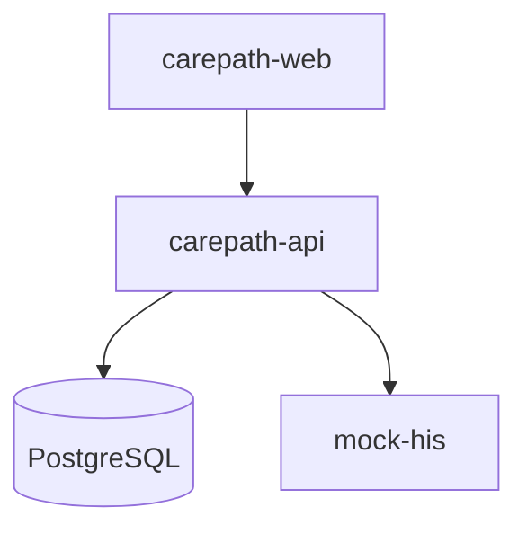

# Deployment

## Hackathon / local

Use `docker compose up --build` from the repository root.

## Future production direction

The same boundaries can be deployed to Kubernetes:

- Web frontend behind ingress/CDN
- CarePath API deployment
- PostgreSQL managed or HA cluster
- HIS adapter with hospital-network connectivity
- Optional MQTT broker + positioning service for Zigbee
- Observability: OpenTelemetry traces/metrics/logs

The blueprint intentionally avoids splitting the CarePath core into microservices before operational need exists.
