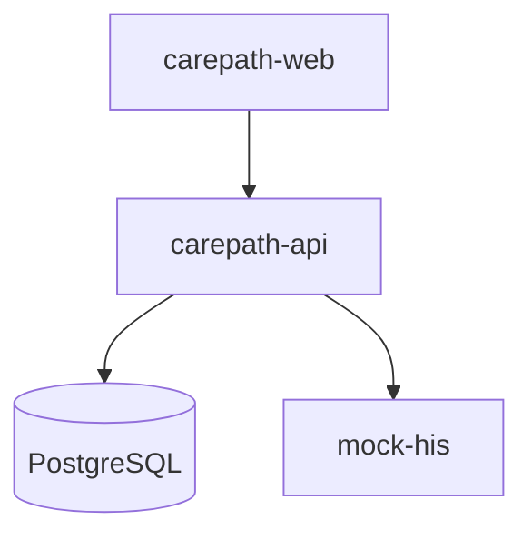

# Deployment

## Hackathon / local

Use `docker compose up --build` from the repository root.

## Secrets and auth configuration

| Variable | Local / demo | Production |
|---|---|---|
| `JWT_SECRET` | may be left unset — the API generates a random key at boot and warns; tokens then die on restart | **required**, ≥32 random bytes, from a secret store rather than `.env` |
| `ACCESS_TOKEN_TTL` / `REFRESH_TOKEN_TTL` | `15m` / `168h` | review against the hospital's session policy |
| Seed users `admin`/`demo`, `staff`/`demo` | created by migration for the demo | delete, deactivate, or change both passwords before exposure |
| `LINE_CHANNEL_ID` | optional (demo auth) | required for real patient logins |
| TLS | not used locally | required — a bearer token on plain HTTP is a token in transit |

Full rationale and the complete pre-deployment checklist: [ADR-0010](../adr/0010-staff-auth-jwt-argon2.md) §10, §12.

## Future production direction

The same boundaries can be deployed to Kubernetes:

- Web frontend behind ingress/CDN
- CarePath API deployment
- PostgreSQL managed or HA cluster
- HIS adapter with hospital-network connectivity
- Optional MQTT broker + positioning service for Zigbee
- Observability: OpenTelemetry traces/metrics/logs

The blueprint intentionally avoids splitting the CarePath core into microservices before operational need exists.
