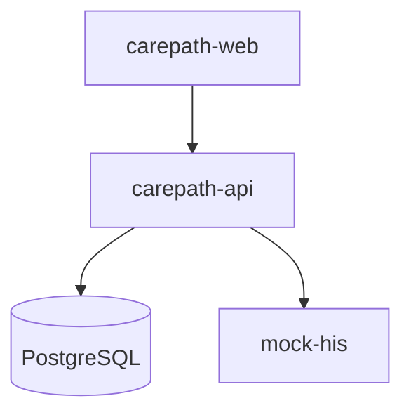

# Deployment

## Hackathon / local



Use `docker compose up --build` from the repository root.

## Dev host — tag-triggered releases

Pushing a `v*` tag (e.g. `git tag v0.1.0 && git push origin v0.1.0`) runs the
[Release workflow](../../.github/workflows/release.yml), which:

1. Builds the four images (`api`, `mock-his`, `web`, `proxy`) and pushes them
   to GHCR as `ghcr.io/somprasongd/carepath-<tier>:<tag>` (plus `latest`).
2. SSHes to the dev host and rolls out the stack in `~/docker-apps/carepath`.

The workflow is also runnable manually (`workflow_dispatch`) from any branch —
it tags images with the branch name instead, which is how the pipeline itself
gets tested before a real tag exists.

### Server layout (`somprasongd@dev.opensource-technology.com` = `61.19.253.24`, SSH port 2297)

| Path | What it is | Managed by |
|---|---|---|
| `~/docker-apps/carepath/docker-compose.yml` | copy of `infra/docker/docker-compose.server.yml` (image-based; no builds on the host) | workflow, every deploy |
| `~/docker-apps/carepath/migrations/` | rsync of `infra/postgres/migrations/` (runs via the `migrate` service on `up`) | workflow, every deploy |
| `~/docker-apps/carepath/.env` | `IMAGE_TAG` (workflow), secrets: `POSTGRES_PASSWORD`, `JWT_SECRET`, `ALLOW_DEMO_AUTH`, `CAREPATH_EDGE_PORT` | `IMAGE_TAG` by workflow; everything else by hand |

The stack is the single-origin topology from `docker-compose.prod.yml`. The
host's ports 80/443 belong to nginx-proxy-manager, so the edge proxy publishes
on host port **8080** (`http://61.19.253.24:8080`) and joins the shared
`webproxy` network with the alias `carepath`.

### Domain & TLS — https://carepath.somprasongd.work

DNS (Cloudflare, **DNS-only** — keep it grey-cloud or Let's Encrypt HTTP-01
renewal breaks): `carepath.somprasongd.work` → `61.19.253.24`.

TLS terminates at nginx-proxy-manager (proxy host id 18, owned by the server
admins): `carepath.somprasongd.work` → `carepath:80` (the edge proxy on the
`webproxy` network), Let's Encrypt cert (issued 2026-09-20, auto-renewed by
NPM), HTTP→HTTPS forced, HTTP/2. No CarePath env knows the domain — the SPA
talks to a relative `/api` and the share token is a bearer credential
(ADR-0011), so nothing needs an external URL configured.

When real patient logins are wanted: point the LINE LIFF endpoint at
`https://carepath.somprasongd.work` and set `LINE_CHANNEL_ID` in the host's
`.env` (HTTPS is a LIFF requirement — satisfied now).

> The `migrate` service pins `search_path=public` on its database URL
> (as `docker-compose.yml` does). Without it, golang-migrate's bookkeeping
> table lands in "first schema in search_path" — `carepath`, once migration
> 000001 has created it — so a fresh DB tracks in `public` while a re-run
> tracks in `carepath` and re-applies everything from scratch into a dirty
> state. Symptom seen live: `relation "journey_closed_round" already exists`
> on a re-run of an already-migrated database.

The workflow authenticates over SSH with a dedicated deploy key
(`carepath-deploy@github-actions`, private half in the repo secret
`DEPLOY_SSH_KEY`, public half in the host's `authorized_keys`). Other repo
secrets: `DEPLOY_HOST`, `DEPLOY_PORT`, `DEPLOY_USER`, `DEPLOY_KNOWN_HOSTS`.
Rotate by generating a new keypair, updating the secret and `authorized_keys`,
and removing the old line. Note the key grants shell access as a docker-group
user — treat repo admin access as host-equivalent.

### Manual operations on the host

```sh
cd ~/docker-apps/carepath
docker compose ps                 # what is running
docker compose logs -f api proxy  # tail logs
# rollback / pin a version:
sed -i 's/^IMAGE_TAG=.*/IMAGE_TAG=v0.0.9/' .env && docker compose up -d
```

`docker compose up` re-runs pending migrations before the API starts
(`migrate` gate), so a rollback must also tolerate newer migrations — prefer
rolling forward over `down` unless the data volume is expendable.

## Secrets and auth configuration

| Variable | Local / demo | Production |
|---|---|---|
| `JWT_SECRET` | may be left unset — the API generates a random key at boot and warns; tokens then die on restart | **required**, ≥32 random bytes, from a secret store rather than `.env` |
| `ACCESS_TOKEN_TTL` / `REFRESH_TOKEN_TTL` | `15m` / `168h` | review against the hospital's session policy |
| `SHARE_LINK_TTL` | `4h` | review against how long a relative should be able to follow a visit ([ADR-0011](../adr/0011-visit-share-link.md)) |
| Seed users `admin`/`demo`, `staff`/`demo` | created by migration for the demo | delete, deactivate, or change both passwords before exposure |
| `LINE_CHANNEL_ID` | optional (demo auth) | required for real patient logins |
| TLS | not used locally | required — a bearer token on plain HTTP is a token in transit |

Full rationale and the complete pre-deployment checklist: [ADR-0010](../adr/0010-staff-auth-jwt-argon2.md) §10, §12.

## Future production direction

The same boundaries can be deployed to Kubernetes:

- Web frontend behind ingress/CDN
- CarePath API deployment
- PostgreSQL managed or HA cluster
- HIS adapter with hospital-network connectivity
- Optional MQTT broker + positioning service for Zigbee
- Observability: OpenTelemetry traces/metrics/logs

The blueprint intentionally avoids splitting the CarePath core into microservices before operational need exists.
