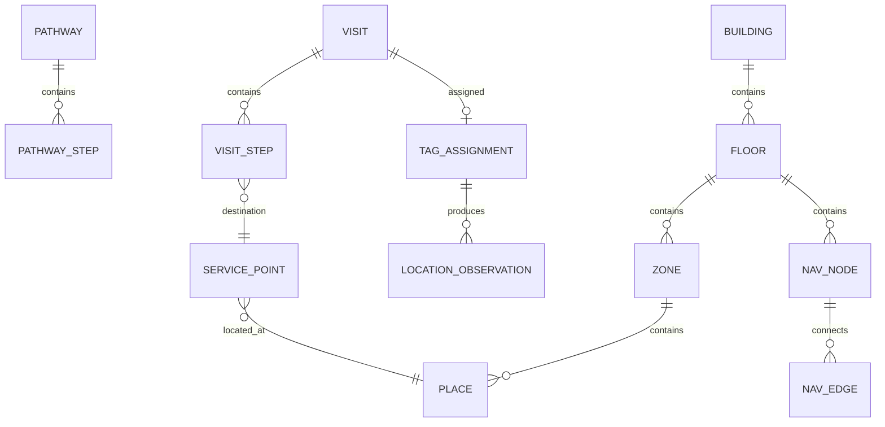

# Domain Model

## Main concepts

### Pathway
Reusable template describing possible care/service steps.

### Visit
Runtime instance for one patient encounter.

### VisitStep
A concrete step in the current visit, with statuses such as `PENDING`, `READY`, `IN_PROGRESS`, `COMPLETED`, `SKIPPED`.

### ServicePoint
Logical destination such as registration, lab, radiology, cashier, or pharmacy. It links clinical/service workflow to physical space.

### Place
Physical place on a floor plan.

### Navigation Node / Edge
Walkable graph used to calculate routes.

### TagAssignment
Optional mapping of an active visit to a Zigbee tag.

### LocationObservation
Normalized observation from QR, Zigbee, or another provider.

## Invariants

1. A `VisitStep` may reference a logical `ServicePoint`; it should not embed map coordinates.
2. A `ServicePoint` intended for navigation must resolve to a `Place`.
3. A routable `Place` must have one or more nearby/entry navigation nodes.
4. Raw Zigbee observations must not leak into journey business rules.
5. Real HIS identifiers may be stored as external references, but CarePath keeps its own internal IDs.
