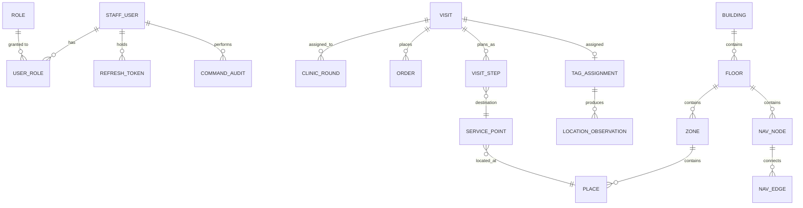

# Domain Model

> This is the **conceptual** target model — the shape the domain is heading
> toward, not necessarily what's persisted today. For the **current**
> Postgres schema, auto-generated from the live database via `make docs-erd`
> (`tbls`), see [docs/architecture/erd/README.md](erd/README.md).

## Main concepts

> Per [ADR-0009](../adr/0009-carepath-owns-journey-plan.md), CarePath derives
> the journey plan itself from HIS-reported facts; the HIS has no step-list
> concept for CarePath to project. `Order` and `ClinicRound` below are the
> HIS-side facts the planner consumes; `VisitStep` is the CarePath-owned
> output.

### Visit
Runtime instance for one patient encounter, HIS-owned (HN, VN, patient name, walk-in/appointment, status).

### ClinicRound
One round of a visit being assigned to a clinic. A visit may have the same clinic more than once (the patient returns after a mid-encounter order); each occurrence is a round, closed by the HIS's `encounter.completed` fact or a staff override.

### Order
A lab, imaging, EKG, or drug order placed against a visit by a clinic, with a lifecycle (`PLACED → PERFORMED → RESULTED`, or `CANCELLED`). HIS-owned.

### VisitStep
A concrete step of the CarePath-derived journey plan, addressed by a stable `stepKey` (not by its display `sequence`, which a replan may renumber). Statuses: `PENDING`, `WAITING` (patient-side action done, waiting on a fact such as an order result), `READY`, `STARTED`, `COMPLETED`, `CANCELLED`. Steps in the same planning phase (ADR-0009 §3) carry no order between them — more than one can be `READY` at once.

### ServicePoint
Logical destination such as registration, lab, radiology, cashier, or pharmacy. It links clinical/service workflow to physical space.

### Place
Physical place on a floor plan.

### Navigation Node / Edge
Walkable graph used to calculate routes.

### StaffUser / Role
A staff or admin account CarePath owns: username, argon2id password hash, display name, active flag, and one or more roles (`STAFF`, `ADMIN` in the MVP) granted many-to-many. Distinct from the patient identity, which CarePath does not own — it comes from LINE and is only ever borrowed for the length of a session ([ADR-0010](../adr/0010-staff-auth-jwt-argon2.md)).

### RefreshToken
A revocable, single-use credential a staff session is renewed with. Stored as a hash, with issued/expiry timestamps plus "spent" and "revoked" markers; rotation replaces it on every use, and replaying a spent one revokes the user's whole set.

### TagAssignment
Optional mapping of an active visit to a Zigbee tag. Not yet a persisted table — the current `location/zigbee` provider produces observations without a durable tag-assignment record; this entity is target-state, per the note at the top of this doc.

### LocationObservation
Normalized observation from QR, Zigbee, or another provider.

## Invariants

1. A `VisitStep` may reference a logical `ServicePoint`; it should not embed map coordinates.
2. A `ServicePoint` intended for navigation must resolve to a `Place`.
3. A routable `Place` must have one or more nearby/entry navigation nodes.
4. Raw Zigbee observations must not leak into journey business rules.
5. Real HIS identifiers may be stored as external references, but CarePath keeps its own internal IDs.
6. A `VisitStep` that is `STARTED`, `COMPLETED`, or `CANCELLED` is history: replanning never removes or reorders it (ADR-0009 §7).
7. `VisitStep`s sharing a planning phase carry no order between them; more than one may be `READY` at once (ADR-0009 §6).
8. The patient's display name (ADR-0009 §8) is the only demographic CarePath stores beyond the opaque HN/VN references, and only for staff-facing reads.
9. A `StaffUser` never carries a patient identity and a patient session never carries a role — the two identity kinds are separate models with separate stores (ADR-0010 §1).
10. A password exists only as an argon2id hash and a refresh token only as its SHA-256 hash; neither the plaintext password nor the raw refresh token is ever persisted or logged (NFR-08).
