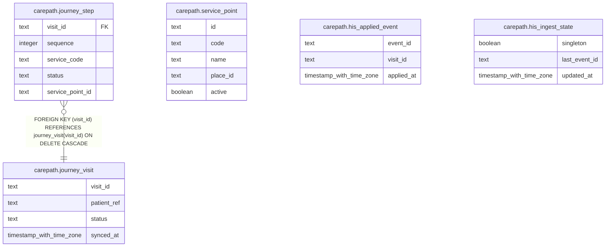

# carepath

## Tables

| Name | Columns | Comment | Type |
| ---- | ------- | ------- | ---- |
| [carepath.service_point](carepath.service_point.md) | 5 |  | BASE TABLE |
| [carepath.journey_visit](carepath.journey_visit.md) | 4 |  | BASE TABLE |
| [carepath.journey_step](carepath.journey_step.md) | 5 |  | BASE TABLE |
| [carepath.his_applied_event](carepath.his_applied_event.md) | 3 |  | BASE TABLE |
| [carepath.his_ingest_state](carepath.his_ingest_state.md) | 3 |  | BASE TABLE |

## Relations

---

> Generated by [tbls](https://github.com/k1LoW/tbls)
