# carepath

## Tables

| Name | Columns | Comment | Type |
| ---- | ------- | ------- | ---- |
| [carepath.service_point](carepath.service_point.md) | 5 |  | BASE TABLE |
| [carepath.journey_visit](carepath.journey_visit.md) | 5 |  | BASE TABLE |
| [carepath.his_applied_event](carepath.his_applied_event.md) | 3 |  | BASE TABLE |
| [carepath.his_ingest_state](carepath.his_ingest_state.md) | 3 |  | BASE TABLE |
| [carepath.patient_session](carepath.patient_session.md) | 6 |  | BASE TABLE |
| [carepath.journey_command_audit](carepath.journey_command_audit.md) | 8 |  | BASE TABLE |
| [carepath.building](carepath.building.md) | 3 |  | BASE TABLE |
| [carepath.floor](carepath.floor.md) | 5 |  | BASE TABLE |
| [carepath.place](carepath.place.md) | 7 |  | BASE TABLE |
| [carepath.nav_node](carepath.nav_node.md) | 6 |  | BASE TABLE |
| [carepath.nav_edge](carepath.nav_edge.md) | 6 |  | BASE TABLE |
| [carepath.location_observation](carepath.location_observation.md) | 9 |  | BASE TABLE |
| [carepath.journey_step](carepath.journey_step.md) | 9 |  | BASE TABLE |
| [carepath.journey_closed_round](carepath.journey_closed_round.md) | 3 |  | BASE TABLE |
| [carepath.app_user](carepath.app_user.md) | 6 |  | BASE TABLE |
| [carepath.role](carepath.role.md) | 3 |  | BASE TABLE |
| [carepath.user_role](carepath.user_role.md) | 2 |  | BASE TABLE |
| [carepath.refresh_token](carepath.refresh_token.md) | 6 |  | BASE TABLE |
| [carepath.journey_step_status_event](carepath.journey_step_status_event.md) | 11 |  | BASE TABLE |

## Relations

```mermaid
erDiagram

"carepath.service_point" }o--|| "carepath.place" : "FOREIGN KEY (place_id) REFERENCES place(place_id)"
"carepath.floor" }o--|| "carepath.building" : "FOREIGN KEY (building_id) REFERENCES building(building_id)"
"carepath.place" }o--|| "carepath.floor" : "FOREIGN KEY (floor_id) REFERENCES floor(floor_id)"
"carepath.place" }o--o| "carepath.nav_node" : "FOREIGN KEY (entry_node_id) REFERENCES nav_node(node_id)"
"carepath.nav_node" }o--|| "carepath.floor" : "FOREIGN KEY (floor_id) REFERENCES floor(floor_id)"
"carepath.nav_edge" }o--|| "carepath.nav_node" : "FOREIGN KEY (from_node_id) REFERENCES nav_node(node_id)"
"carepath.nav_edge" }o--|| "carepath.nav_node" : "FOREIGN KEY (to_node_id) REFERENCES nav_node(node_id)"
"carepath.location_observation" }o--|| "carepath.nav_node" : "FOREIGN KEY (node_id) REFERENCES nav_node(node_id)"
"carepath.journey_step" }o--|| "carepath.journey_visit" : "FOREIGN KEY (visit_id) REFERENCES journey_visit(visit_id) ON DELETE CASCADE"
"carepath.journey_closed_round" }o--|| "carepath.journey_visit" : "FOREIGN KEY (visit_id) REFERENCES journey_visit(visit_id) ON DELETE CASCADE"
"carepath.user_role" }o--|| "carepath.app_user" : "FOREIGN KEY (user_id) REFERENCES app_user(user_id) ON DELETE CASCADE"
"carepath.user_role" }o--|| "carepath.role" : "FOREIGN KEY (role_id) REFERENCES role(role_id)"
"carepath.refresh_token" }o--|| "carepath.app_user" : "FOREIGN KEY (user_id) REFERENCES app_user(user_id) ON DELETE CASCADE"
"carepath.journey_step_status_event" }o--|| "carepath.journey_visit" : "FOREIGN KEY (visit_id) REFERENCES journey_visit(visit_id) ON DELETE CASCADE"

"carepath.service_point" {
  text id
  text code
  text name
  text place_id FK
  boolean active
}
"carepath.journey_visit" {
  text visit_id
  text patient_ref
  text status
  timestamp_with_time_zone synced_at
  text patient_name
}
"carepath.his_applied_event" {
  text event_id
  text visit_id
  timestamp_with_time_zone applied_at
}
"carepath.his_ingest_state" {
  boolean singleton
  text last_event_id
  timestamp_with_time_zone updated_at
}
"carepath.patient_session" {
  text token
  text source
  text external_id
  text display_name
  timestamp_with_time_zone created_at
  timestamp_with_time_zone expires_at
}
"carepath.journey_command_audit" {
  text command_id
  text visit_id
  text to_status
  text source
  timestamp_with_time_zone created_at
  text step_key
  text actor_user_id
  text actor_username
}
"carepath.building" {
  text building_id
  text code
  text name
}
"carepath.floor" {
  text floor_id
  text building_id FK
  text code
  text name
  integer level_order
}
"carepath.place" {
  text place_id
  text floor_id FK
  text name
  text place_type
  numeric x
  numeric y
  text entry_node_id FK
}
"carepath.nav_node" {
  text node_id
  text floor_id FK
  numeric x
  numeric y
  text node_type
  text zone
}
"carepath.nav_edge" {
  text edge_id
  text from_node_id FK
  text to_node_id FK
  text edge_type
  numeric distance
  boolean accessible
}
"carepath.location_observation" {
  bigint id
  text visit_id
  text source
  text node_id FK
  text floor_id
  text zone
  double_precision confidence
  timestamp_with_time_zone observed_at
  timestamp_with_time_zone recorded_at
}
"carepath.journey_step" {
  text visit_id FK
  text step_key
  integer sequence
  text kind
  text clinic_code
  integer round
  text__ order_refs
  text status
  text service_point_id
}
"carepath.journey_closed_round" {
  text visit_id FK
  text step_key
  timestamp_with_time_zone closed_at
}
"carepath.app_user" {
  text user_id
  text username
  text password_hash
  text full_name
  boolean is_active
  timestamp_with_time_zone created_at
}
"carepath.role" {
  text role_id
  text code
  text name
}
"carepath.user_role" {
  text user_id FK
  text role_id FK
}
"carepath.refresh_token" {
  text token_hash
  text user_id FK
  timestamp_with_time_zone issued_at
  timestamp_with_time_zone expires_at
  timestamp_with_time_zone used_at
  timestamp_with_time_zone revoked_at
}
"carepath.journey_step_status_event" {
  bigint event_id
  text visit_id FK
  text step_key
  text kind
  text service_point_id
  text from_status
  text to_status
  text source
  text actor_user_id
  text actor_username
  timestamp_with_time_zone occurred_at
}
```

---

> Generated by [tbls](https://github.com/k1LoW/tbls)
