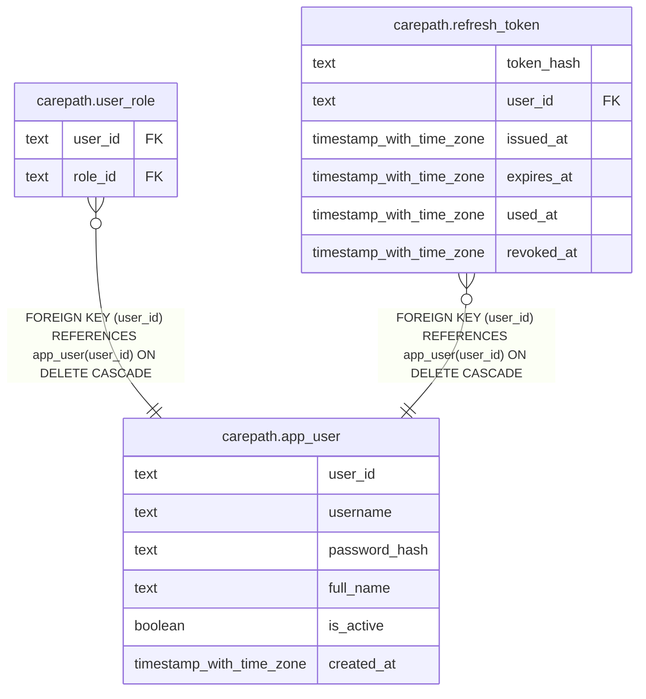

# carepath.app_user

## Columns

| Name | Type | Default | Nullable | Children | Parents | Comment |
| ---- | ---- | ------- | -------- | -------- | ------- | ------- |
| user_id | text |  | false | [carepath.user_role](carepath.user_role.md) [carepath.refresh_token](carepath.refresh_token.md) |  |  |
| username | text |  | false |  |  |  |
| password_hash | text |  | false |  |  |  |
| full_name | text |  | false |  |  |  |
| is_active | boolean | true | false |  |  |  |
| created_at | timestamp with time zone | now() | false |  |  |  |

## Constraints

| Name | Type | Definition |
| ---- | ---- | ---------- |
| app_user_pkey | PRIMARY KEY | PRIMARY KEY (user_id) |
| app_user_username_key | UNIQUE | UNIQUE (username) |

## Indexes

| Name | Definition |
| ---- | ---------- |
| app_user_pkey | CREATE UNIQUE INDEX app_user_pkey ON carepath.app_user USING btree (user_id) |
| app_user_username_key | CREATE UNIQUE INDEX app_user_username_key ON carepath.app_user USING btree (username) |

## Relations

---

> Generated by [tbls](https://github.com/k1LoW/tbls)
