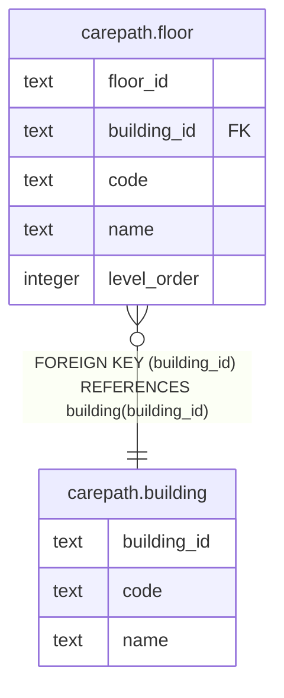

# carepath.building

## Columns

| Name | Type | Default | Nullable | Children | Parents | Comment |
| ---- | ---- | ------- | -------- | -------- | ------- | ------- |
| building_id | text |  | false | [carepath.floor](carepath.floor.md) |  |  |
| code | text |  | false |  |  |  |
| name | text |  | false |  |  |  |

## Constraints

| Name | Type | Definition |
| ---- | ---- | ---------- |
| building_pkey | PRIMARY KEY | PRIMARY KEY (building_id) |
| building_code_key | UNIQUE | UNIQUE (code) |

## Indexes

| Name | Definition |
| ---- | ---------- |
| building_pkey | CREATE UNIQUE INDEX building_pkey ON carepath.building USING btree (building_id) |
| building_code_key | CREATE UNIQUE INDEX building_code_key ON carepath.building USING btree (code) |

## Relations

---

> Generated by [tbls](https://github.com/k1LoW/tbls)
