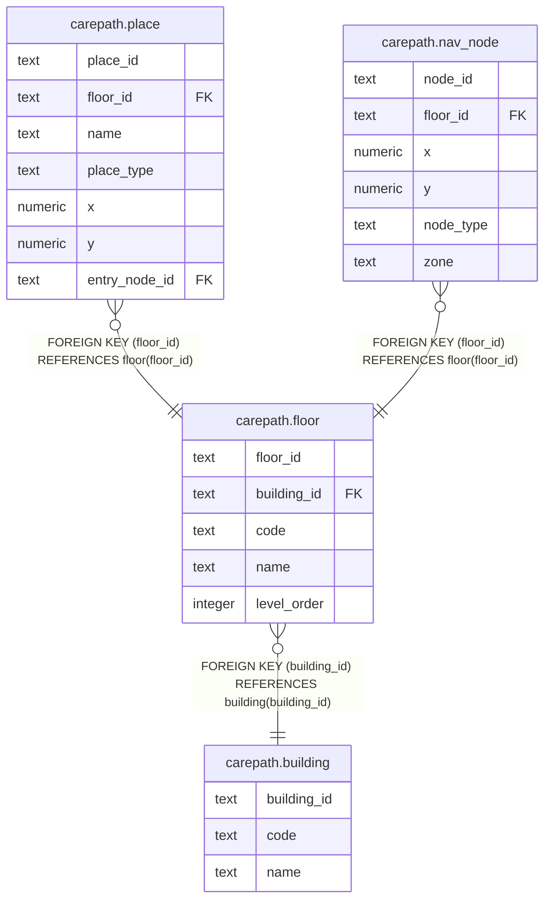

# carepath.floor

## Columns

| Name | Type | Default | Nullable | Children | Parents | Comment |
| ---- | ---- | ------- | -------- | -------- | ------- | ------- |
| floor_id | text |  | false | [carepath.place](carepath.place.md) [carepath.nav_node](carepath.nav_node.md) |  |  |
| building_id | text |  | false |  | [carepath.building](carepath.building.md) |  |
| code | text |  | false |  |  |  |
| name | text |  | false |  |  |  |
| level_order | integer |  | false |  |  |  |

## Constraints

| Name | Type | Definition |
| ---- | ---- | ---------- |
| floor_building_id_fkey | FOREIGN KEY | FOREIGN KEY (building_id) REFERENCES building(building_id) |
| floor_pkey | PRIMARY KEY | PRIMARY KEY (floor_id) |
| floor_building_id_code_key | UNIQUE | UNIQUE (building_id, code) |

## Indexes

| Name | Definition |
| ---- | ---------- |
| floor_pkey | CREATE UNIQUE INDEX floor_pkey ON carepath.floor USING btree (floor_id) |
| floor_building_id_code_key | CREATE UNIQUE INDEX floor_building_id_code_key ON carepath.floor USING btree (building_id, code) |

## Relations

---

> Generated by [tbls](https://github.com/k1LoW/tbls)
