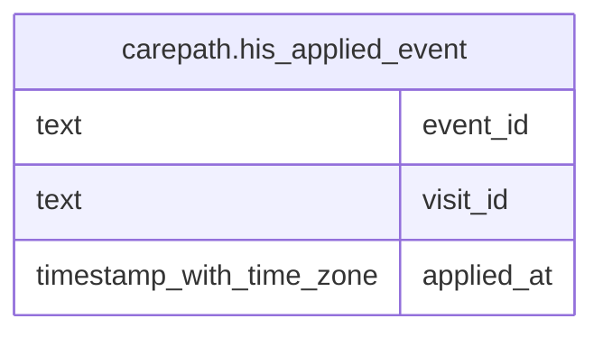

# carepath.his_applied_event

## Columns

| Name | Type | Default | Nullable | Children | Parents | Comment |
| ---- | ---- | ------- | -------- | -------- | ------- | ------- |
| event_id | text |  | false |  |  |  |
| visit_id | text |  | false |  |  |  |
| applied_at | timestamp with time zone | now() | false |  |  |  |

## Constraints

| Name | Type | Definition |
| ---- | ---- | ---------- |
| his_applied_event_pkey | PRIMARY KEY | PRIMARY KEY (event_id) |

## Indexes

| Name | Definition |
| ---- | ---------- |
| his_applied_event_pkey | CREATE UNIQUE INDEX his_applied_event_pkey ON carepath.his_applied_event USING btree (event_id) |

## Relations

---

> Generated by [tbls](https://github.com/k1LoW/tbls)
