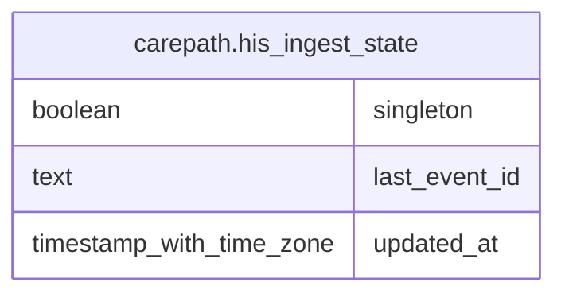

# carepath.his_ingest_state

## Columns

| Name | Type | Default | Nullable | Children | Parents | Comment |
| ---- | ---- | ------- | -------- | -------- | ------- | ------- |
| singleton | boolean | true | false |  |  |  |
| last_event_id | text | ''::text | false |  |  |  |
| updated_at | timestamp with time zone | now() | false |  |  |  |

## Constraints

| Name | Type | Definition |
| ---- | ---- | ---------- |
| his_ingest_state_singleton_check | CHECK | CHECK (singleton) |
| his_ingest_state_pkey | PRIMARY KEY | PRIMARY KEY (singleton) |

## Indexes

| Name | Definition |
| ---- | ---------- |
| his_ingest_state_pkey | CREATE UNIQUE INDEX his_ingest_state_pkey ON carepath.his_ingest_state USING btree (singleton) |

## Relations

---

> Generated by [tbls](https://github.com/k1LoW/tbls)
