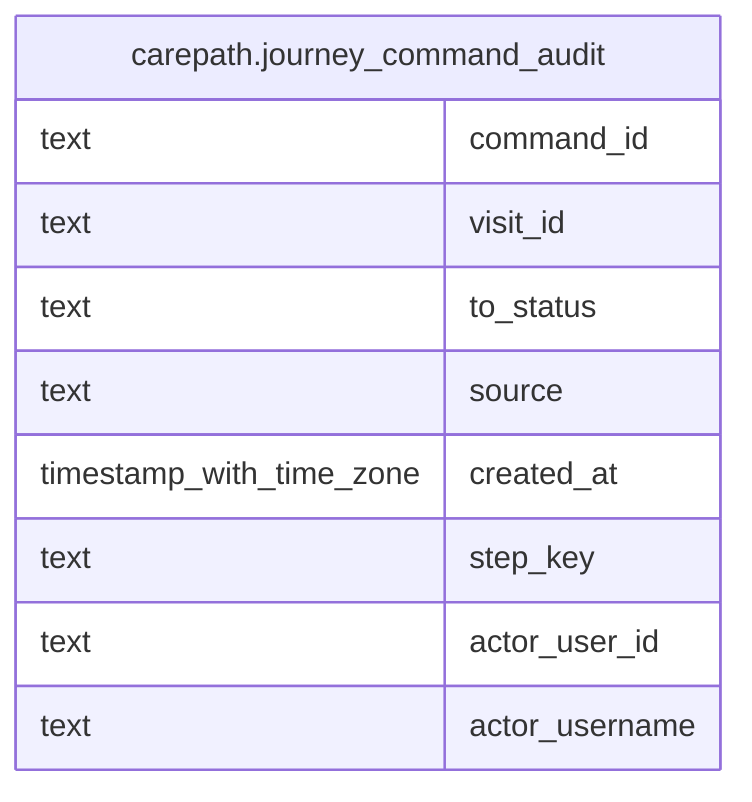

# carepath.journey_command_audit

## Columns

| Name | Type | Default | Nullable | Children | Parents | Comment |
| ---- | ---- | ------- | -------- | -------- | ------- | ------- |
| command_id | text |  | false |  |  |  |
| visit_id | text |  | false |  |  |  |
| to_status | text |  | false |  |  |  |
| source | text | 'unknown'::text | false |  |  |  |
| created_at | timestamp with time zone | now() | false |  |  |  |
| step_key | text |  | false |  |  |  |
| actor_user_id | text |  | true |  |  |  |
| actor_username | text |  | true |  |  |  |

## Constraints

| Name | Type | Definition |
| ---- | ---- | ---------- |
| journey_command_audit_pkey | PRIMARY KEY | PRIMARY KEY (command_id) |

## Indexes

| Name | Definition |
| ---- | ---------- |
| journey_command_audit_pkey | CREATE UNIQUE INDEX journey_command_audit_pkey ON carepath.journey_command_audit USING btree (command_id) |

## Relations

---

> Generated by [tbls](https://github.com/k1LoW/tbls)
