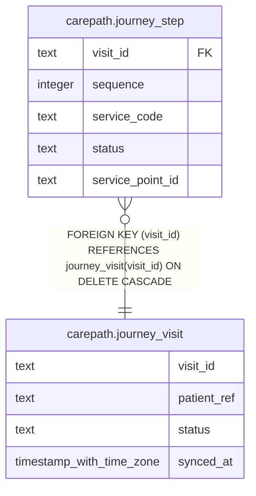

# carepath.journey_step

## Columns

| Name | Type | Default | Nullable | Children | Parents | Comment |
| ---- | ---- | ------- | -------- | -------- | ------- | ------- |
| visit_id | text |  | false |  | [carepath.journey_visit](carepath.journey_visit.md) |  |
| sequence | integer |  | false |  |  |  |
| service_code | text |  | false |  |  |  |
| status | text |  | false |  |  |  |
| service_point_id | text |  | true |  |  |  |

## Constraints

| Name | Type | Definition |
| ---- | ---- | ---------- |
| journey_step_visit_id_fkey | FOREIGN KEY | FOREIGN KEY (visit_id) REFERENCES journey_visit(visit_id) ON DELETE CASCADE |
| journey_step_pkey | PRIMARY KEY | PRIMARY KEY (visit_id, sequence) |

## Indexes

| Name | Definition |
| ---- | ---------- |
| journey_step_pkey | CREATE UNIQUE INDEX journey_step_pkey ON carepath.journey_step USING btree (visit_id, sequence) |

## Relations

---

> Generated by [tbls](https://github.com/k1LoW/tbls)
