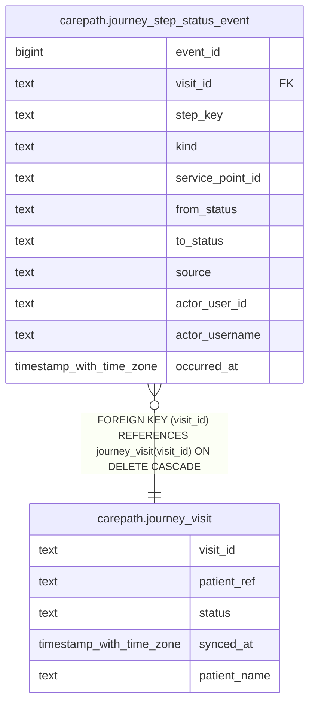

# carepath.journey_step_status_event

## Columns

| Name | Type | Default | Nullable | Children | Parents | Comment |
| ---- | ---- | ------- | -------- | -------- | ------- | ------- |
| event_id | bigint |  | false |  |  |  |
| visit_id | text |  | false |  | [carepath.journey_visit](carepath.journey_visit.md) |  |
| step_key | text |  | false |  |  |  |
| kind | text |  | false |  |  |  |
| service_point_id | text |  | true |  |  |  |
| from_status | text |  | true |  |  |  |
| to_status | text |  | false |  |  |  |
| source | text |  | false |  |  |  |
| actor_user_id | text |  | true |  |  |  |
| actor_username | text |  | true |  |  |  |
| occurred_at | timestamp with time zone | now() | false |  |  |  |

## Constraints

| Name | Type | Definition |
| ---- | ---- | ---------- |
| journey_step_status_event_visit_id_fkey | FOREIGN KEY | FOREIGN KEY (visit_id) REFERENCES journey_visit(visit_id) ON DELETE CASCADE |
| journey_step_status_event_pkey | PRIMARY KEY | PRIMARY KEY (event_id) |

## Indexes

| Name | Definition |
| ---- | ---------- |
| journey_step_status_event_pkey | CREATE UNIQUE INDEX journey_step_status_event_pkey ON carepath.journey_step_status_event USING btree (event_id) |
| journey_step_status_event_visit_idx | CREATE INDEX journey_step_status_event_visit_idx ON carepath.journey_step_status_event USING btree (visit_id, occurred_at) |
| journey_step_status_event_service_point_idx | CREATE INDEX journey_step_status_event_service_point_idx ON carepath.journey_step_status_event USING btree (service_point_id, occurred_at) |
| journey_step_status_event_to_status_idx | CREATE INDEX journey_step_status_event_to_status_idx ON carepath.journey_step_status_event USING btree (to_status, occurred_at) |

## Relations

---

> Generated by [tbls](https://github.com/k1LoW/tbls)
