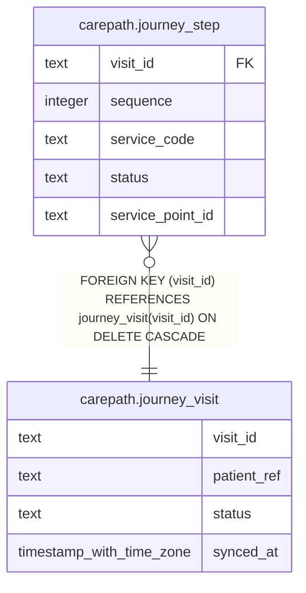

# carepath.journey_visit

## Columns

| Name | Type | Default | Nullable | Children | Parents | Comment |
| ---- | ---- | ------- | -------- | -------- | ------- | ------- |
| visit_id | text |  | false | [carepath.journey_step](carepath.journey_step.md) |  |  |
| patient_ref | text |  | false |  |  |  |
| status | text |  | false |  |  |  |
| synced_at | timestamp with time zone | now() | false |  |  |  |

## Constraints

| Name | Type | Definition |
| ---- | ---- | ---------- |
| journey_visit_pkey | PRIMARY KEY | PRIMARY KEY (visit_id) |

## Indexes

| Name | Definition |
| ---- | ---------- |
| journey_visit_pkey | CREATE UNIQUE INDEX journey_visit_pkey ON carepath.journey_visit USING btree (visit_id) |

## Relations

---

> Generated by [tbls](https://github.com/k1LoW/tbls)
