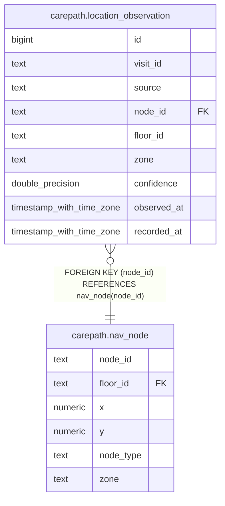

# carepath.location_observation

## Columns

| Name | Type | Default | Nullable | Children | Parents | Comment |
| ---- | ---- | ------- | -------- | -------- | ------- | ------- |
| id | bigint |  | false |  |  |  |
| visit_id | text |  | false |  |  |  |
| source | text |  | false |  |  |  |
| node_id | text |  | false |  | [carepath.nav_node](carepath.nav_node.md) |  |
| floor_id | text |  | false |  |  |  |
| zone | text |  | true |  |  |  |
| confidence | double precision |  | true |  |  |  |
| observed_at | timestamp with time zone |  | false |  |  |  |
| recorded_at | timestamp with time zone | now() | false |  |  |  |

## Constraints

| Name | Type | Definition |
| ---- | ---- | ---------- |
| location_observation_node_id_fkey | FOREIGN KEY | FOREIGN KEY (node_id) REFERENCES nav_node(node_id) |
| location_observation_pkey | PRIMARY KEY | PRIMARY KEY (id) |

## Indexes

| Name | Definition |
| ---- | ---------- |
| location_observation_pkey | CREATE UNIQUE INDEX location_observation_pkey ON carepath.location_observation USING btree (id) |
| location_observation_visit_idx | CREATE INDEX location_observation_visit_idx ON carepath.location_observation USING btree (visit_id, id DESC) |

## Relations

---

> Generated by [tbls](https://github.com/k1LoW/tbls)
