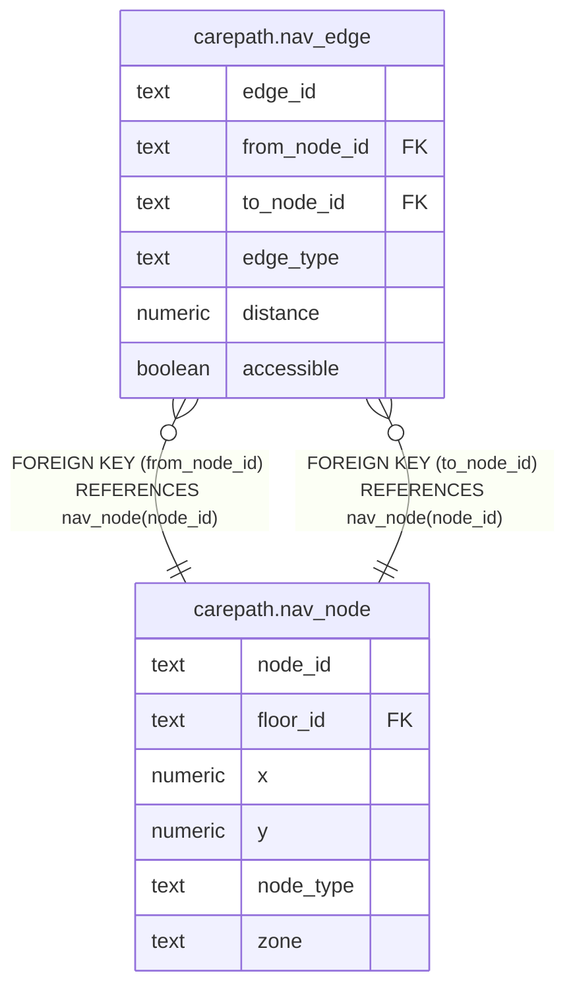

# carepath.nav_edge

## Columns

| Name | Type | Default | Nullable | Children | Parents | Comment |
| ---- | ---- | ------- | -------- | -------- | ------- | ------- |
| edge_id | text |  | false |  |  |  |
| from_node_id | text |  | false |  | [carepath.nav_node](carepath.nav_node.md) |  |
| to_node_id | text |  | false |  | [carepath.nav_node](carepath.nav_node.md) |  |
| edge_type | text |  | false |  |  |  |
| distance | numeric |  | false |  |  |  |
| accessible | boolean | true | false |  |  |  |

## Constraints

| Name | Type | Definition |
| ---- | ---- | ---------- |
| nav_edge_check | CHECK | CHECK ((from_node_id <> to_node_id)) |
| nav_edge_edge_type_check | CHECK | CHECK ((edge_type = ANY (ARRAY['CORRIDOR'::text, 'ELEVATOR'::text, 'STAIRS'::text]))) |
| nav_edge_from_node_id_fkey | FOREIGN KEY | FOREIGN KEY (from_node_id) REFERENCES nav_node(node_id) |
| nav_edge_to_node_id_fkey | FOREIGN KEY | FOREIGN KEY (to_node_id) REFERENCES nav_node(node_id) |
| nav_edge_pkey | PRIMARY KEY | PRIMARY KEY (edge_id) |

## Indexes

| Name | Definition |
| ---- | ---------- |
| nav_edge_pkey | CREATE UNIQUE INDEX nav_edge_pkey ON carepath.nav_edge USING btree (edge_id) |
| nav_edge_from_node_idx | CREATE INDEX nav_edge_from_node_idx ON carepath.nav_edge USING btree (from_node_id) |
| nav_edge_to_node_idx | CREATE INDEX nav_edge_to_node_idx ON carepath.nav_edge USING btree (to_node_id) |

## Relations

---

> Generated by [tbls](https://github.com/k1LoW/tbls)
