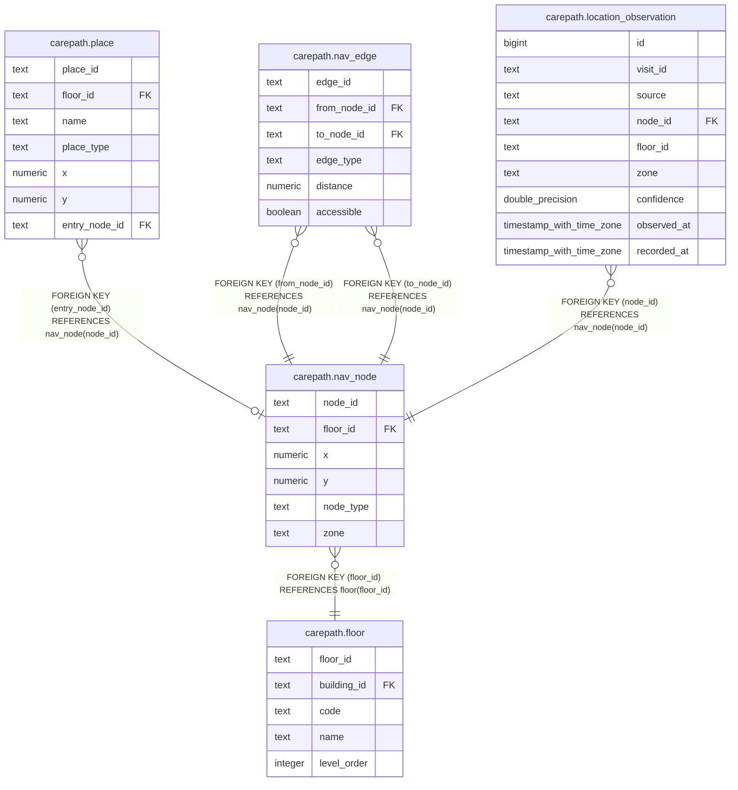

# carepath.nav_node

## Columns

| Name | Type | Default | Nullable | Children | Parents | Comment |
| ---- | ---- | ------- | -------- | -------- | ------- | ------- |
| node_id | text |  | false | [carepath.place](carepath.place.md) [carepath.nav_edge](carepath.nav_edge.md) [carepath.location_observation](carepath.location_observation.md) |  |  |
| floor_id | text |  | false |  | [carepath.floor](carepath.floor.md) |  |
| x | numeric |  | false |  |  |  |
| y | numeric |  | false |  |  |  |
| node_type | text |  | false |  |  |  |
| zone | text |  | true |  |  |  |

## Constraints

| Name | Type | Definition |
| ---- | ---- | ---------- |
| nav_node_node_type_check | CHECK | CHECK ((node_type = ANY (ARRAY['ENTRANCE'::text, 'PLACE_ENTRY'::text, 'CORRIDOR'::text, 'ELEVATOR'::text, 'STAIRS'::text]))) |
| nav_node_floor_id_fkey | FOREIGN KEY | FOREIGN KEY (floor_id) REFERENCES floor(floor_id) |
| nav_node_pkey | PRIMARY KEY | PRIMARY KEY (node_id) |

## Indexes

| Name | Definition |
| ---- | ---------- |
| nav_node_pkey | CREATE UNIQUE INDEX nav_node_pkey ON carepath.nav_node USING btree (node_id) |
| nav_node_floor_idx | CREATE INDEX nav_node_floor_idx ON carepath.nav_node USING btree (floor_id) |

## Relations

---

> Generated by [tbls](https://github.com/k1LoW/tbls)
