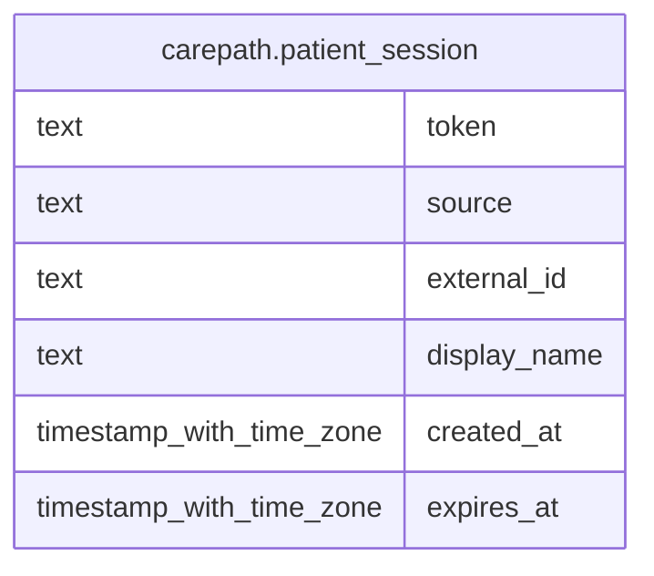

# carepath.patient_session

## Columns

| Name | Type | Default | Nullable | Children | Parents | Comment |
| ---- | ---- | ------- | -------- | -------- | ------- | ------- |
| token | text |  | false |  |  |  |
| source | text |  | false |  |  |  |
| external_id | text |  | false |  |  |  |
| display_name | text |  | true |  |  |  |
| created_at | timestamp with time zone | now() | false |  |  |  |
| expires_at | timestamp with time zone |  | false |  |  |  |

## Constraints

| Name | Type | Definition |
| ---- | ---- | ---------- |
| patient_session_pkey | PRIMARY KEY | PRIMARY KEY (token) |

## Indexes

| Name | Definition |
| ---- | ---------- |
| patient_session_pkey | CREATE UNIQUE INDEX patient_session_pkey ON carepath.patient_session USING btree (token) |
| patient_session_expires_at_idx | CREATE INDEX patient_session_expires_at_idx ON carepath.patient_session USING btree (expires_at) |

## Relations

---

> Generated by [tbls](https://github.com/k1LoW/tbls)
