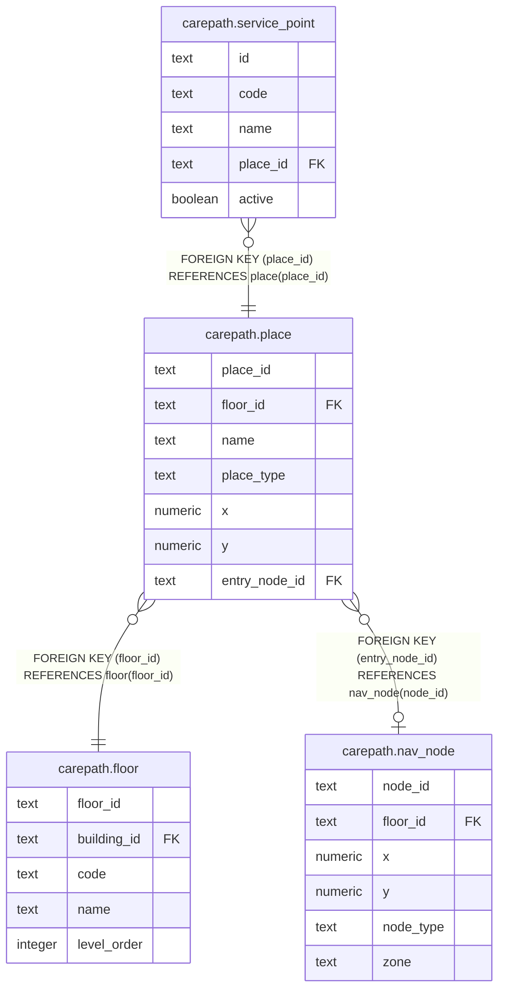

# carepath.place

## Columns

| Name | Type | Default | Nullable | Children | Parents | Comment |
| ---- | ---- | ------- | -------- | -------- | ------- | ------- |
| place_id | text |  | false | [carepath.service_point](carepath.service_point.md) |  |  |
| floor_id | text |  | false |  | [carepath.floor](carepath.floor.md) |  |
| name | text |  | false |  |  |  |
| place_type | text |  | false |  |  |  |
| x | numeric |  | true |  |  |  |
| y | numeric |  | true |  |  |  |
| entry_node_id | text |  | true |  | [carepath.nav_node](carepath.nav_node.md) |  |

## Constraints

| Name | Type | Definition |
| ---- | ---- | ---------- |
| place_place_type_check | CHECK | CHECK ((place_type = ANY (ARRAY['ROOM'::text, 'COUNTER'::text, 'WAITING_AREA'::text, 'RESTROOM'::text, 'ELEVATOR'::text, 'STAIRWAY'::text, 'RAMP'::text, 'ENTRANCE'::text, 'AMENITY'::text]))) |
| place_floor_id_fkey | FOREIGN KEY | FOREIGN KEY (floor_id) REFERENCES floor(floor_id) |
| place_pkey | PRIMARY KEY | PRIMARY KEY (place_id) |
| place_entry_node_id_fkey | FOREIGN KEY | FOREIGN KEY (entry_node_id) REFERENCES nav_node(node_id) |

## Indexes

| Name | Definition |
| ---- | ---------- |
| place_pkey | CREATE UNIQUE INDEX place_pkey ON carepath.place USING btree (place_id) |

## Relations

---

> Generated by [tbls](https://github.com/k1LoW/tbls)
