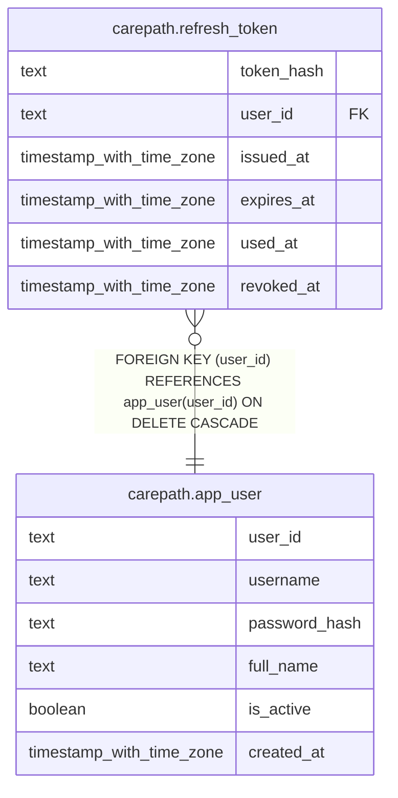

# carepath.refresh_token

## Columns

| Name | Type | Default | Nullable | Children | Parents | Comment |
| ---- | ---- | ------- | -------- | -------- | ------- | ------- |
| token_hash | text |  | false |  |  |  |
| user_id | text |  | false |  | [carepath.app_user](carepath.app_user.md) |  |
| issued_at | timestamp with time zone | now() | false |  |  |  |
| expires_at | timestamp with time zone |  | false |  |  |  |
| used_at | timestamp with time zone |  | true |  |  |  |
| revoked_at | timestamp with time zone |  | true |  |  |  |

## Constraints

| Name | Type | Definition |
| ---- | ---- | ---------- |
| refresh_token_user_id_fkey | FOREIGN KEY | FOREIGN KEY (user_id) REFERENCES app_user(user_id) ON DELETE CASCADE |
| refresh_token_pkey | PRIMARY KEY | PRIMARY KEY (token_hash) |

## Indexes

| Name | Definition |
| ---- | ---------- |
| refresh_token_pkey | CREATE UNIQUE INDEX refresh_token_pkey ON carepath.refresh_token USING btree (token_hash) |
| refresh_token_user_idx | CREATE INDEX refresh_token_user_idx ON carepath.refresh_token USING btree (user_id) |
| refresh_token_expires_at_idx | CREATE INDEX refresh_token_expires_at_idx ON carepath.refresh_token USING btree (expires_at) |

## Relations

---

> Generated by [tbls](https://github.com/k1LoW/tbls)
