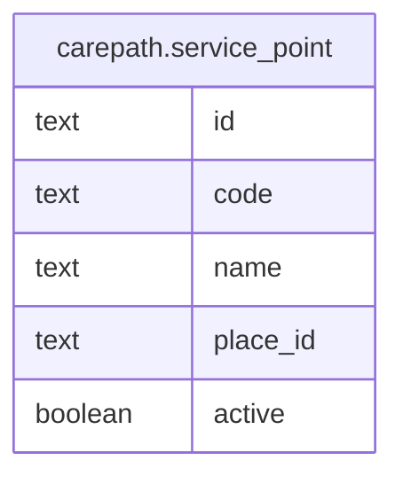

# carepath.service_point

## Columns

| Name | Type | Default | Nullable | Children | Parents | Comment |
| ---- | ---- | ------- | -------- | -------- | ------- | ------- |
| id | text |  | false |  |  |  |
| code | text |  | false |  |  |  |
| name | text |  | false |  |  |  |
| place_id | text |  | false |  |  |  |
| active | boolean | true | false |  |  |  |

## Constraints

| Name | Type | Definition |
| ---- | ---- | ---------- |
| service_point_pkey | PRIMARY KEY | PRIMARY KEY (id) |
| service_point_code_key | UNIQUE | UNIQUE (code) |

## Indexes

| Name | Definition |
| ---- | ---------- |
| service_point_pkey | CREATE UNIQUE INDEX service_point_pkey ON carepath.service_point USING btree (id) |
| service_point_code_key | CREATE UNIQUE INDEX service_point_code_key ON carepath.service_point USING btree (code) |

## Relations

---

> Generated by [tbls](https://github.com/k1LoW/tbls)
