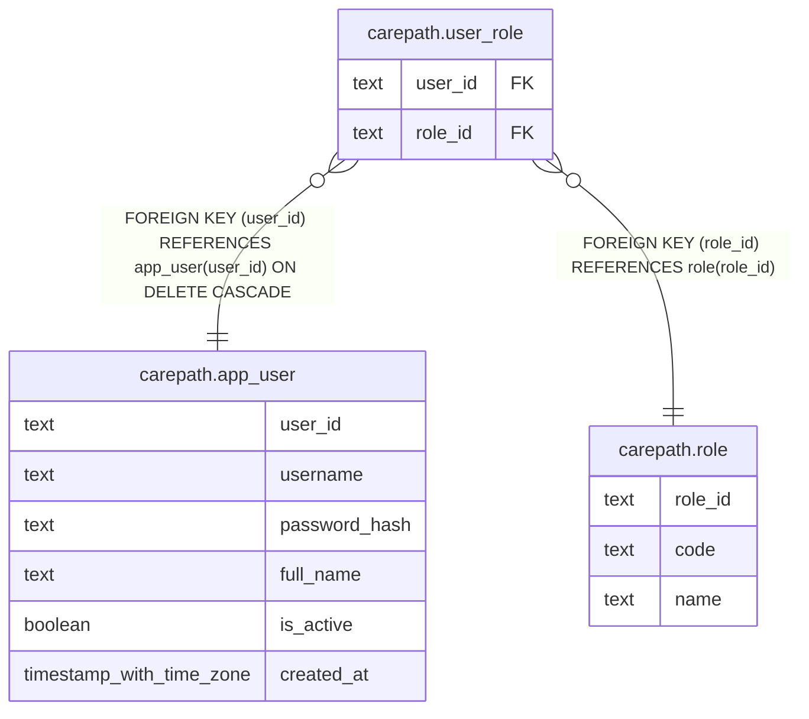

# carepath.user_role

## Columns

| Name | Type | Default | Nullable | Children | Parents | Comment |
| ---- | ---- | ------- | -------- | -------- | ------- | ------- |
| user_id | text |  | false |  | [carepath.app_user](carepath.app_user.md) |  |
| role_id | text |  | false |  | [carepath.role](carepath.role.md) |  |

## Constraints

| Name | Type | Definition |
| ---- | ---- | ---------- |
| user_role_user_id_fkey | FOREIGN KEY | FOREIGN KEY (user_id) REFERENCES app_user(user_id) ON DELETE CASCADE |
| user_role_role_id_fkey | FOREIGN KEY | FOREIGN KEY (role_id) REFERENCES role(role_id) |
| user_role_pkey | PRIMARY KEY | PRIMARY KEY (user_id, role_id) |

## Indexes

| Name | Definition |
| ---- | ---------- |
| user_role_pkey | CREATE UNIQUE INDEX user_role_pkey ON carepath.user_role USING btree (user_id, role_id) |

## Relations

---

> Generated by [tbls](https://github.com/k1LoW/tbls)
