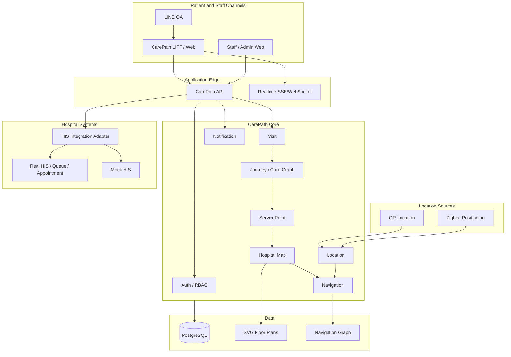

# System Architecture

## Objective

CarePath helps a patient understand **what to do next**, **where the next service is**, and **how to get there** inside a hospital. It does not replace the HIS.

## Responsibility split

| Component | Responsibility |
|---|---|
| HIS | Clinical/transaction source of truth: appointment, visit, orders, queue/service state |
| Care Graph | Determines the current and next care/service step |
| ServicePoint | Maps a logical service to a physical place |
| Hospital Map | Stores building/floor/zone/place relationships |
| Navigation Graph | Calculates a route through walkable nodes and edges |
| Location Provider | Resolves the patient's current place/zone |
| LINE LIFF/Web | Presents journey and navigation |
| Auth | Authenticates staff/admin users (argon2id password → JWT access + rotating refresh token) and carries their roles into every request; patients authenticate separately via LINE ([ADR-0010](../adr/0010-staff-auth-jwt-argon2.md)) |

## Key principle

A care step should not contain route geometry. It references a `ServicePoint`, which resolves to a `Place`, which is connected to the navigation graph. This separation allows service workflow and hospital map/navigation to evolve independently.
