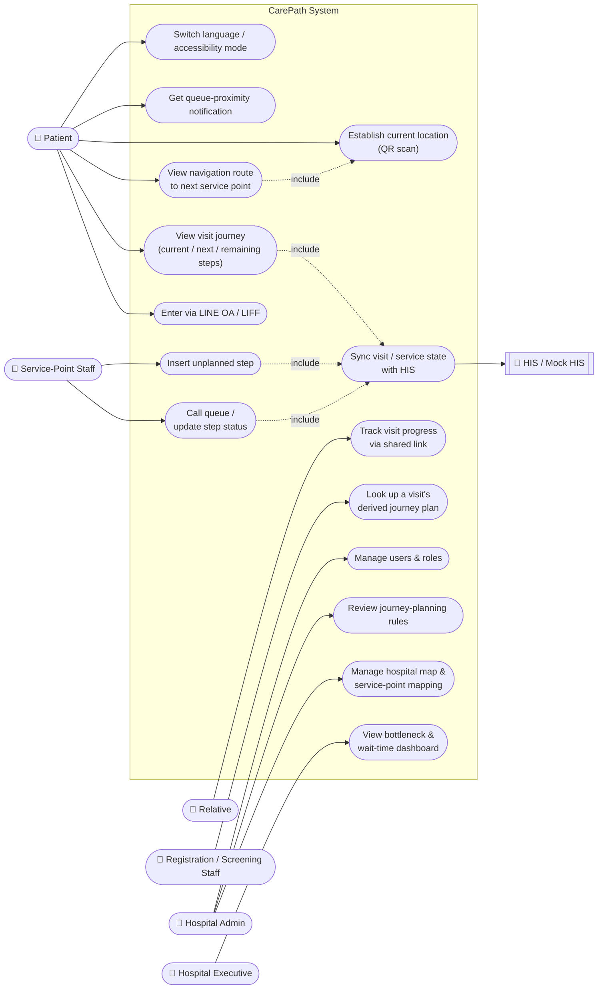

# 1. Requirement Specification (เอกสารความต้องการ)

**Deliverable 1 of 6** per the hackathon brief §10 ("โจทย์ Hackathon ที่ 1 : CarePath"): a summary of functional and non-functional requirements, with User Stories and a Use Case Diagram. This document is a synthesis of the living source-of-truth docs under [`docs/requirements/`](../requirements/) — those docs stay authoritative and are updated as the system evolves; this file is the point-in-time submission snapshot.

## 1.1 Product overview

CarePath is a patient journey and indoor navigation web application for a hospital that has grown building-by-building, scattering its service points across separate buildings and floors. It answers two questions for a patient on a single hospital visit: **what step comes next, and how do I physically get there** — without relying on GPS, which does not work indoors.

| | |
|---|---|
| Primary users | Patient / relative (LINE OA + LIFF/web); registration & screening staff; service-point staff (exam room, lab, X-ray, pharmacy); hospital admin; hospital executive |
| Core idea | Separate *what's next* (Care Graph / Pathway) from *how to get there* (Hospital Map + Navigation Graph), joined by a `ServicePoint → Place` mapping |
| Location without GPS | QR-code scan as the baseline provider; manual selection as fallback; Zigbee as an optional phase-2 provider — all behind one location-provider interface |
| HIS integration | CarePath does not read the hospital's HIS database directly; Mock HIS stands in for a real HIS behind a stable adapter/port. The HIS reports visit/clinic/order/encounter **facts** only — it has no concept of an ordered journey — and CarePath derives the patient's plan from them (see [ADR-0005](../adr/0005-his-adapter-and-mock-his.md), [ADR-0009](../adr/0009-carepath-owns-journey-plan.md), superseding [ADR-0008](../adr/0008-his-canonical-event-contract.md) on this point) |

Full narrative: [Product Requirements](../requirements/product-requirements.md).

## 1.2 Actors

| Actor | Role in the system |
|---|---|
| Patient / relative | Views their own visit journey, gets routed to the next step, receives queue notifications; a relative can follow progress via a shared link |
| Registration / screening staff | Looks up a visit CarePath has already derived a plan for, once the HIS reports it opened (ADR-0009); does not create the visit or enter anything into the HIS from CarePath |
| Service-point staff | Calls the queue, updates step status, inserts unplanned steps |
| Hospital admin | Maintains hospital map data, service-point mapping, pathway templates, and user/role access |
| Hospital executive | Views wait-time and bottleneck reporting across service points |
| HIS / Mock HIS (external system) | System of record for visit and service-step status; CarePath reads/forwards through an adapter, never direct DB access |

## 1.3 Scope (MoSCoW, brief §5)

Full detail and current build status: [MVP Scope](../requirements/mvp-scope.md).

| ID | Requirement | Priority | Functional requirement |
|---|---|---|---|
| M1 | Hospital map data: buildings, floors, places/service points, connecting routes | Must | [FR-05](../requirements/functional-requirements.md), [FR-11](../requirements/functional-requirements.md) |
| M2 | Journey planning rules (hospital policy encoded in CarePath's planner, ADR-0009 — supersedes the earlier "Care Pathway Template" design) | Must | [FR-13](../requirements/functional-requirements.md) |
| M3 | Journey visibility for registration staff (look up a visit's derived plan) | Must | [FR-14](../requirements/functional-requirements.md) |
| M4 | Patient journey screen (steps, status, what's next) | Must | [FR-03](../requirements/functional-requirements.md) |
| M5 | Step-by-step navigation instructions with distance/time | Must | [FR-04](../requirements/functional-requirements.md), [FR-08](../requirements/functional-requirements.md) |
| M6 | Shortest-route calculation from graph data (no hardcoded routes) | Must | [FR-07](../requirements/functional-requirements.md) |
| M7 | Service-point staff console (call queue, update status, insert unplanned step) | Must | [FR-15](../requirements/functional-requirements.md), [FR-16](../requirements/functional-requirements.md) |
| M8 | Authentication & role-based access control | Must | [FR-18](../requirements/functional-requirements.md) |
| S1 | Queue length & wait-time estimate | Should | [FR-17](../requirements/functional-requirements.md) |
| S2 | QR-code current-location scanning | Should | [FR-06](../requirements/functional-requirements.md) |
| S3 | Floor plan image with route overlay | Should | [FR-08](../requirements/functional-requirements.md) |
| S4 | Thai/English language switch | Should | [FR-19](../requirements/functional-requirements.md) |
| S5 | Accessibility mode (large text, avoid-stairs route) | Should | [FR-20](../requirements/functional-requirements.md) |
| S6 | Queue-proximity notification | Should | [FR-21](../requirements/functional-requirements.md) |
| S7 | Executive bottleneck / wait-time dashboard | Should | [FR-22](../requirements/functional-requirements.md) |
| C1 | Automatic re-sequencing on abnormal queue length | Could | [FR-23](../requirements/functional-requirements.md) |
| C2 | Relative tracking via time-limited link | Could | [FR-24](../requirements/functional-requirements.md) |
| C3 | Voice-guided navigation | Could | [FR-25](../requirements/functional-requirements.md) |
| C4 | Nearby amenity suggestions along route | Could | [FR-26](../requirements/functional-requirements.md) |

## 1.4 Functional requirements (summary)

Full detail: [Functional Requirements](../requirements/functional-requirements.md).

| FR | Summary |
|---|---|
| FR-01 | Patient entry via LINE OA / LIFF |
| FR-02 | Resolve the patient's active visit via HIS / Mock HIS |
| FR-03 | Display current, completed, and next visit steps |
| FR-04 | Resolve the next actionable step to a ServicePoint and physical Place |
| FR-05 | Display the correct building/floor SVG for the destination |
| FR-06 | Resolve current location (QR baseline; pluggable providers) |
| FR-07 | Calculate a route from the navigation graph |
| FR-08 | Render the route as an overlay on the floor plan |
| FR-09 | Mock HIS provides deterministic demo data |
| FR-10 | CarePath core depends only on a stable HIS contract, never vendor-specific endpoints |
| FR-11 | Staff can configure buildings/floors/places/service points and their mappings |
| FR-12 | Zigbee observations can update location without touching journey-domain code |
| FR-13 | *(Superseded by ADR-0009)* Admin can review the journey-planning rules CarePath's planner applies — no longer a per-patient template staff assemble, since the HIS reports no ordered step list to template against |
| FR-14 | Registration staff looks up a visit by VN and sees the plan CarePath derived for it; HIS remains sole system of record for visit opening and orders (ADR-0009) |
| FR-15 | Service-point staff call the queue and update step status |
| FR-16 | Staff insert an unplanned step without breaking prerequisite ordering |
| FR-17 | Display queue length and estimated wait time per service point |
| FR-18 | Authentication and role-based access control; patients see only their own data |
| FR-19 | Thai/English runtime language switch |
| FR-20 | Large-text mode and stairs-avoiding route option |
| FR-21 | Notify a patient when their queue is approaching |
| FR-22 | Executive dashboard: average wait time per service point, bottleneck identification |
| FR-23 | (Stretch) Automatic re-sequencing on abnormal queue length |
| FR-24 | (Stretch) Relative tracking via time-limited link |
| FR-25 | (Stretch) Voice-guided navigation instructions |
| FR-26 | (Stretch) Nearby amenity suggestions along the route |
| FR-27 | *(Added by ADR-0009)* CarePath derives the journey plan from HIS-reported facts, not a step list |
| FR-28 | *(Added by ADR-0009)* The plan recomputes on every new fact, preserving in-progress/completed steps |
| FR-29 | *(Added by ADR-0009)* A mid-encounter diagnostic order infers a return to the same clinic; the clinic can confirm or override |
| FR-30 | *(Added by ADR-0009)* Independent steps (e.g. a lab and an X-ray both ordered before the same clinic visit) are actionable concurrently |

## 1.5 Non-functional requirements (summary)

Full detail: [Non-Functional Requirements](../requirements/non-functional-requirements.md).

| NFR | Summary |
|---|---|
| NFR-01 Maintainability | Care Graph, spatial model, routing, and HIS integration are separate modules with explicit interfaces |
| NFR-02 Replaceability | Mock HIS can be swapped for a real HIS adapter without touching CarePath domain logic |
| NFR-03 Privacy | No unnecessary patient data in URLs, QR payloads, logs, or floor-plan assets; opaque identifiers |
| NFR-04 Availability degradation | Navigation stays usable via QR/manual location if realtime positioning is unavailable |
| NFR-05 Performance | Route calculation feels interactive; primary screens render within 3 seconds on demo data |
| NFR-06 Observability | Structured logs and health endpoints; OpenTelemetry recommended |
| NFR-07 Contract-first integration | Externally visible HTTP contracts are OpenAPI, version-controlled |
| NFR-08 Security | Server-side session verification; RBAC on staff/admin endpoints; one-way password hashing; parameterized queries; HIS credentials server-side only; TLS in production |
| NFR-09 Audit trail | Every visit/step/queue status change records who, when, and old→new status |
| NFR-10 Usability | Usable without training; human-readable error messages, never raw system errors |
| NFR-11 Accessibility | Large text, sufficient color contrast, usable on small screens |
| NFR-12 Backup and recovery | Backup/recovery approach documented at design level |

## 1.6 User stories

Full stories with acceptance rationale: [User Stories](../requirements/user-stories.md).

| ID | Actor | I want to... | So that... | Priority |
|---|---|---|---|---|
| US-01 | Patient | open CarePath from LINE OA | I can continue my journey without installing another app | Must (M4) |
| US-02 | Patient | see my current and next step | I understand what I need to do | Must (M4) |
| US-03 | Patient | see where the next service is and how to walk there | I don't need to ask staff for directions | Must (M5, M6) |
| US-04 | Patient | scan a nearby QR code | CarePath can calculate a route from a known location | Should (S2) |
| US-09 | Patient | get larger text and a stairs-free route | I can navigate safely as an elderly/wheelchair user | Should (S5) |
| US-10 | Patient | be notified when my queue is near | I can rest elsewhere without missing my turn | Should (S6) |
| US-11 | Patient | switch the app to English | I can understand my journey as a foreign patient | Should (S4) |
| US-12 | Relative | follow the patient's current step via a shared link | I can arrive to pick them up on time | Could (C2) |
| US-13 | Registration staff | look up a visit by VN and see its derived plan | I can hand the patient a clear starting point | Must (M3) |
| US-14 | Service-point staff | call the queue and mark a step complete | the patient auto-advances to the next step | Must (M7) |
| US-15 | Service-point staff | send a patient to an extra unplanned step | the visit plan matches reality without breaking ordering | Must (M7) |
| US-05 | Hospital admin | map a logical service (e.g. LAB) to a physical place | workflow changes are independent of floor-plan design | Must (M1) |
| US-06 | Hospital admin | maintain floor/route data independently of clinical flow | facility changes (e.g. a moved room) don't break pathways or routes | Must (M1, M6) |
| US-16 | Hospital admin | review the journey-planning rules CarePath applies | I can tell when a patient's derived plan reflects hospital policy correctly | Must (M2) |
| US-17 | Hospital admin | manage user accounts and role permissions | each role sees/does only what it should | Must (M8) |
| US-18 | Hospital executive | see bottlenecks and average wait time | I can allocate staff where needed | Should (S7) |
| US-07 | Developer | use Mock HIS for deterministic visits/service states | demo and tests don't depend on production HIS | Must (supports M3–M7) |
| US-08 | Integration engineer | consume a stable HIS port from CarePath core | a real HIS connector can replace Mock HIS without touching journey/navigation logic | Non-functional |
| US-19 | Patient | have my remaining steps reordered when a queue is abnormally long | I spend less time waiting overall | Could (C1) |
| US-20 | Patient | hear navigation instructions read aloud | I can follow the route without reading | Could (C3) |
| US-21 | Patient | see a nearby restroom/waiting area/food stall on the way | I can take care of other needs without a detour | Could (C4) |

## 1.7 Use case diagram

Full diagram with actor→use case→requirement traceability: [Use Case Diagram](../requirements/use-case-diagram.md).

Authentication and role-based access (FR-18) is a precondition of every staff/admin/executive use case (UC8–UC14) and is omitted as an edge to keep the diagram readable. UC8 has no edge into UC15: per ADR-0009 the HIS opens the visit and reports orders/clinics/encounters itself, and CarePath derives the journey plan from those facts — it never sends a step-related command back to the HIS. The fact→plan flow this collapses into one edge is spelled out in [docs/integration/mock-his.md § How CarePath turns HIS facts into a journey plan](../integration/mock-his.md#how-carepath-turns-his-facts-into-a-journey-plan).

## 1.8 Key design constraints (from the brief and ADRs)

- No GPS indoors — location is established via QR scan, manual selection, or (optionally) Zigbee, behind one provider interface ([ADR-0004](../adr/0004-location-provider-abstraction.md)).
- CarePath never reads the HIS database directly; all HIS access is through an adapter, with Mock HIS as the interim implementation ([ADR-0005](../adr/0005-his-adapter-and-mock-his.md)).
- The HIS has no concept of an ordered patient journey — it reports visit/clinic/order/encounter facts and CarePath derives the plan itself ([ADR-0009](../adr/0009-carepath-owns-journey-plan.md), amending [ADR-0008](../adr/0008-his-canonical-event-contract.md)).
- Care Graph (what's next) and Navigation Graph (how to get there) are kept as separate models ([ADR-0002](../adr/0002-separate-care-and-navigation-graphs.md)).
- Floor plans are SVG for the MVP — no 3D ([ADR-0003](../adr/0003-svg-floor-plan.md)).
- The relational database must reach at least 3NF (covered in deliverable 2, ER Diagram and Database Design — not yet produced).
