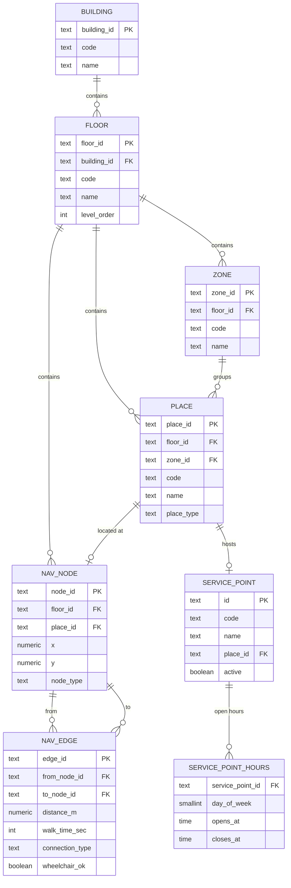
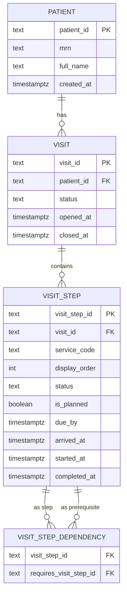
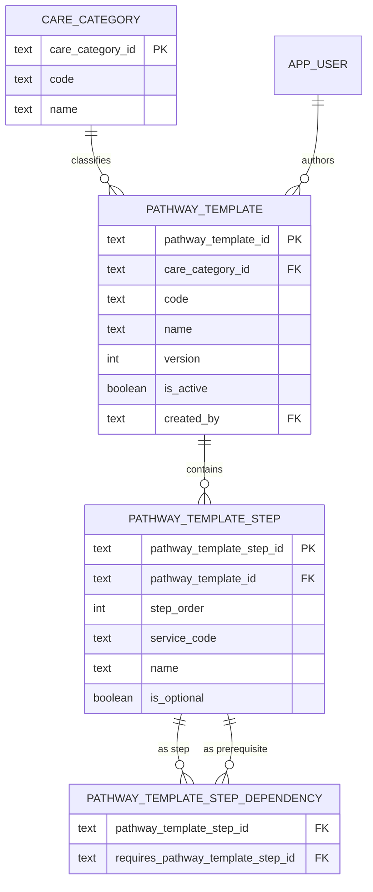
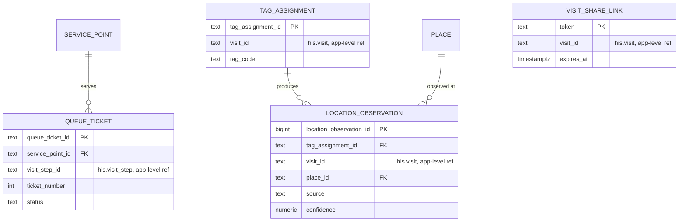
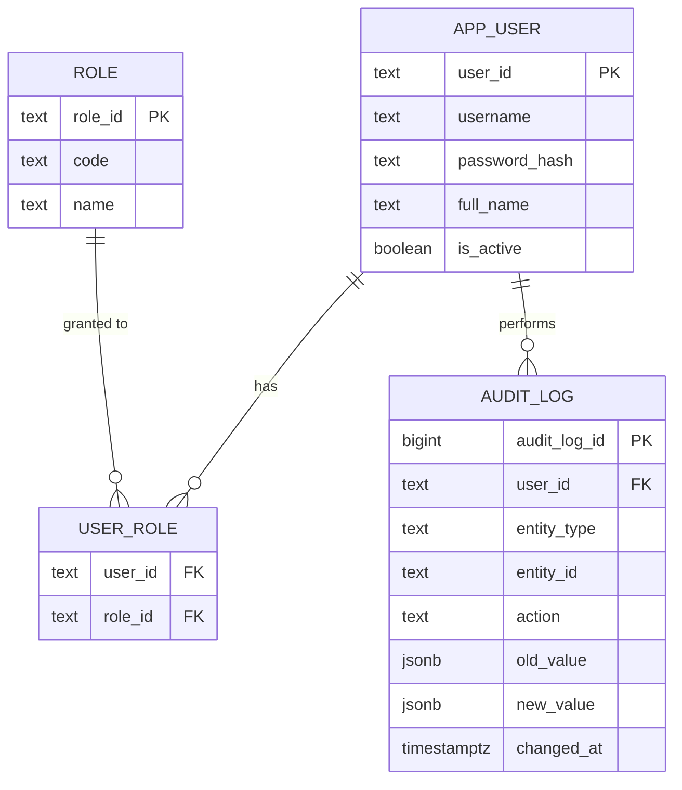

# 2. ER Diagram and Database Structure (แผนภาพ ER และโครงสร้างฐานข้อมูล)

**Deliverable 2 of 6** per the hackathon brief §10: an ER diagram, SQL scripts to create the tables, and an explanation of normalization. This design covers the full requirement scope from [deliverable 1](01-requirement-specification.md) (Must/Should/Could), following the brief's own instruction (§7) that the team designs the ER diagram itself — the brief's entity list is a starting point, not a checklist.

## 2.1 What's already real vs. what this document adds

Today the only table actually migrated is `carepath.service_point` (`infra/postgres/migrations/000001_init_schema.up.sql`), which is why the tool-generated snapshot at [`docs/architecture/erd/`](../architecture/erd/) shows just that one table — it's accurate, not stale, for what exists right now. Mock HIS (`apps/mock-his`) has no database at all yet; it serves one hardcoded visit from an in-memory map.

This document designs the full schema needed for the Must/Should/Could scope, as two runnable SQL scripts:

- [`sql/mock-his-schema.sql`](sql/mock-his-schema.sql) — the `his` schema (owned by `apps/mock-his`)
- [`sql/carepath-schema.sql`](sql/carepath-schema.sql) — the `carepath` schema (owned by `apps/api`), extending the existing `service_point` table

**Both scripts were verified end-to-end**: applied in order (`000001_init_schema.up.sql` → `000002_seed_service_points.up.sql` → `mock-his-schema.sql` → `carepath-schema.sql`) against a disposable PostgreSQL 17 container (matching the version pinned in `docker-compose.yml`), then inspected with `tbls` (the same tool `make docs-erd` uses) to confirm every foreign key resolves and no table is orphaned. When these tables are actually implemented module-by-module, split each section into its own `infra/postgres/migrations/NNN_*.up.sql`/`.down.sql` pair and re-run `make docs-erd` to regenerate `docs/architecture/erd/` for real.

## 2.2 One database, two schemas — and why

ADR-0005 requires that "CarePath must not query the HIS database directly." For the hackathon, both schemas run in the single `postgres:17-alpine` container already in `docker-compose.yml` (no second database container to stand up under time pressure), but the boundary is kept as sharp as if they were physically separate:

| | `his` schema | `carepath` schema |
|---|---|---|
| Owned/written by | `apps/mock-his` only | `apps/api` only |
| Holds | Patient, Visit, VisitStep — the clinical/visit state a real hospital HIS would own | Hospital map, service points, pathway templates, queue, users/roles, audit log, location — CarePath's own operational and spatial data |
| Cross-references | none into `carepath` | Stores HIS ids (`visit_id`, `visit_step_id`) as **opaque text, not a database foreign key** — `apps/api` reaches HIS data only through the HIS adapter/API (ADR-0005, ADR-0008), never a cross-schema SQL join |

This mirrors the trade-off ADR-0007 already accepts for cross-module boundaries inside `apps/api` ("module discipline relies on review rather than the compiler") — here it's enforced by which service holds which `DATABASE_URL`, not by a database-level constraint. If/when a real HIS replaces Mock HIS, only the adapter changes; nothing in the `carepath` schema does.

## 2.3 ER diagrams

Grouped the same way the brief itself groups the data (§7), plus RBAC/audit for M8/NFR-09.

### A. Hospital map (M1)

### B. Patient and visit (`his` schema)

### C. Care pathway templates (M2)

### D. Queue and location (M7, S1, S2, C2)

### E. Identity, RBAC, and audit (M8, NFR-09)

### Cross-schema references (application-enforced, not a DB foreign key)

| `carepath` column | Refers to | Enforced by |
|---|---|---|
| `queue_ticket.visit_step_id` | `his.visit_step.visit_step_id` | HIS adapter validates the step exists/is READY before a ticket is created |
| `tag_assignment.visit_id` | `his.visit.visit_id` | HIS adapter validates the visit is ACTIVE |
| `location_observation.visit_id` | `his.visit.visit_id` | same |
| `visit_share_link.visit_id` | `his.visit.visit_id` | link creation checks the visit is ACTIVE; expiry is time-based, not FK-based |

## 2.4 Design questions the brief raises (§7)

**How are nodes and edges related, and how does that stay efficient for shortest-path?**
`nav_edge` is a plain directed adjacency list (`from_node_id`, `to_node_id`, `distance_m`, `walk_time_sec`), indexed on both columns. Dijkstra/A* read it as a standard weighted directed graph — no recursive CTE or extra join needed to expand a "connection" into a direction.

**Are walking connections always bidirectional?**
No, and the schema doesn't force an answer either way: every connection is **one directed row**. An ordinary two-way corridor is simply two rows (A→B and B→A) with the same distance/time. A one-way fire-escape stair is a single row. An elevator that skips a floor needs no special "floor restriction" flag — it just has no edge row connecting to that floor's elevator node, which falls straight out of the graph model.

**How does an unplanned step get inserted without breaking existing before/after ordering?**
This is why prerequisites are **not** encoded as a bare integer sequence. `display_order` is only a free-to-renumber display hint; the actual "must happen after" rule lives in `visit_step_dependency` (and, at the template level, `pathway_template_step_dependency`) as an explicit self-referencing edge. Inserting an unplanned step (M7) means: insert one `visit_step` row (`is_planned = false`) and one or more `visit_step_dependency` rows pointing at whatever step it must follow — none of the existing rows or their dependencies need to change.

**What data is sensitive and shouldn't appear on a public screen?**
`his.patient.full_name`, `his.care_category`-derived diagnosis/category names, and any free-text visit detail must never be joined into a public-facing view — e.g., the service-point queue-call screen (US-14) should display only `queue_ticket.ticket_number`, never the patient's name or care category. This is [NFR-03](../requirements/non-functional-requirements.md) applied at the schema/view level, not just the API layer.

## 2.5 Normalization (3NF, per the brief's technical requirement §8)

- **1NF** — every column is atomic. Steps are rows in `visit_step`, not an array/CSV column on `visit`; prerequisites are rows in a dependency table, not a comma-separated list of step ids.
- **2NF** — every non-key column depends on the *whole* primary key. The composite-key join tables (`visit_step_dependency`, `pathway_template_step_dependency`, `user_role`, `service_point_hours`) carry no descriptive column beyond the key itself, so partial dependency can't arise.
- **3NF** — no non-key column depends on another non-key column (no transitive dependency):
  - `visit_step` stores `service_code`, not the service point's name/place — those are looked up from `carepath.service_point` by code.
  - `floor`/`place` store only `building_id`/`floor_id`, never a copied-down building or floor name.
  - `pathway_template_step` stores `service_code`, not a duplicated service-point name.
  - `user_role` stores no role name — it's looked up from `role` by `role_id`.

## 2.6 SQL scripts

- [`sql/mock-his-schema.sql`](sql/mock-his-schema.sql) — `his` schema: `patient`, `visit`, `visit_step`, `visit_step_dependency`
- [`sql/carepath-schema.sql`](sql/carepath-schema.sql) — `carepath` schema: hospital map, service-point hours, identity/RBAC, audit log, pathway templates, queue, location, relative-tracking links, plus role reference data

Apply order: `000001_init_schema.up.sql` → `000002_seed_service_points.up.sql` → `mock-his-schema.sql` → `carepath-schema.sql`.

## 2.7 Next step

These two scripts are a design deliverable, not yet wired into `golang-migrate`. When a module in the [technical blueprint](../architecture/technical-blueprint.md)'s "planned" list (`hospitalmap`, `journey`/pathway, `identity`) gets built, carve its tables out of these files into `infra/postgres/migrations/NNN_*.up.sql`/`.down.sql`, add the matching `.down.sql` (`DROP TABLE`/`DROP SCHEMA` in reverse order), and run `make docs-erd` so `docs/architecture/erd/` reflects the real, live schema again.
