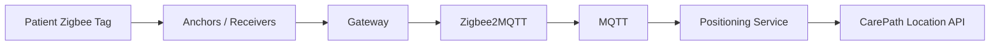

# QR and Zigbee Location

## MVP: QR location

A QR code identifies a stable CarePath place, for example:

```text
https://carepath.example/location/PLACE-OPD-ENTRANCE
```

Scanning it establishes a known location and route start point.

## Zigbee extension

Suggested flow:



The positioning service should output normalized observations such as building/floor/zone/place/confidence.

## Tag assignment

```text
Visit -> TagAssignment -> Zigbee Tag
```

Assignment is temporary and released at the end of the visit.

## Design rule

The LIFF/browser must not connect directly to Zigbee hardware. Hardware integration remains server/edge-side.
