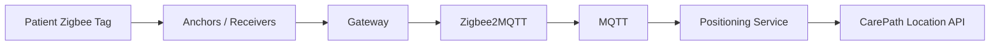

# QR and Zigbee Location

## MVP: QR location

A QR code identifies a stable CarePath place, for example:

```text
https://carepath.example/location/PLACE-OPD-ENTRANCE
```

Scanning it establishes a known location and route start point.

## Zigbee extension

Suggested flow:



The positioning service should output normalized observations such as building/floor/zone/place/confidence.

### MVP simulator (#33)

Until real hardware exists, `POST /api/v1/demo/zigbee/location` simulates
the positioning-service push: `{visitId, floorId, zone, confidence?}`. The
fix resolves through the canonical ZIGBEE location provider (ADR-0004) to
the zone's representative navigation node and becomes the visit's routing
start point. The simulator is an adapter of its own — a real Zigbee
integration (the flow above) lands as a separate provider and does not
reuse it. The call requires a `STAFF`/`ADMIN` access token (same
`Authorization: Bearer …` as the other staff surfaces): it moves the
visit's routing origin, so it is a staff tool, not an open write.

## Tag assignment

```text
Visit -> TagAssignment -> Zigbee Tag
```

Assignment is temporary and released at the end of the visit.

## Design rule

The LIFF/browser must not connect directly to Zigbee hardware. Hardware integration remains server/edge-side.
