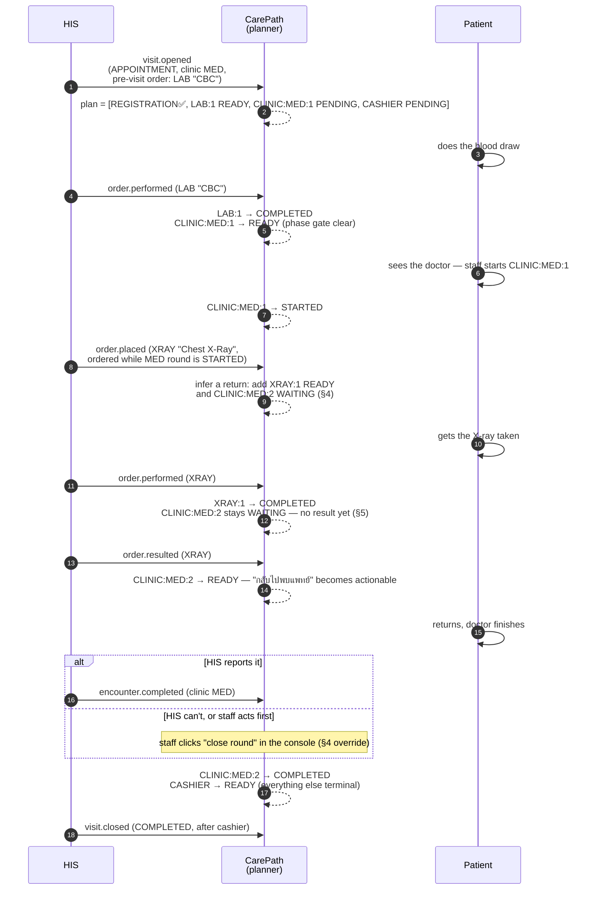

# Mock HIS

## Purpose

Mock HIS is a deterministic fake upstream hospital system used for the hackathon and automated development. It is not a second implementation of CarePath business logic.

## Responsibilities

Per [ADR-0009](../adr/0009-carepath-owns-journey-plan.md), the HIS has no concept of an ordered patient journey — it only knows clinical facts. Mock HIS provides:

- patient/visit reference (HN/VN), patient display name, walk-in vs appointment
- which clinic(s) the visit is assigned to
- orders (lab, x-ray, EKG, ultrasound, drug) and their lifecycle: placed → performed → resulted
- when a clinic finishes examining the patient for a round (`encounter.completed`)
- visit status (open/completed/cancelled)

It does **not** decide step order, own step status, or calculate indoor routes — those are CarePath's (journey planner and navigation module respectively).

## Demo visits

The starter project seeds two deterministic scenarios (identifiers are
stable across resets — see the repository README's reset procedure):

```text
VISIT-001  สมชาย ใจดี (HN PATIENT-DEMO-001)  APPOINTMENT
  clinic MED assigned
  order ORD-001 LAB "CBC"  PLACED, ordered before the visit opened

VISIT-002  สมหญิง รักษ์ดี (HN PATIENT-DEMO-002)  WALKIN   (#39 demo happy path)
  clinic MED assigned
  order ORD-002 XRAY "Chest X-ray"  PLACED, ordered mid-visit by MED
```

CarePath's journey planner turns VISIT-001 into: registration (done at
open) → lab (pre-visit order) → clinic MED → cashier, and VISIT-002 into:
registration (done) → clinic MED → X-ray (mid-visit order), with the
return round and pharmacy appearing as the demo drives the later facts
(start the clinic step, result the X-ray, place a DRUG order). The
CarePath API maps clinic codes and order types to internal service points
such as `LAB-01` (the `servicepoint` module).

## Integration contract (ADR-0008, amended by ADR-0009)

The canonical HIS↔CarePath contract lives in [`packages/contracts/openapi/mock-his.yaml`](../../packages/contracts/openapi/mock-his.yaml) (source of truth per ADR-0006) and has two surfaces:

- **Snapshot read (pull):** `GET /api/v1/visits/{visitId}` — the visit, its clinics, and its orders, as the HIS currently has them.
- **Event feed (pull):** `GET /api/v1/events?after={eventId}` — append-only canonical facts (`visit.opened/updated/closed`, `order.placed/performed/resulted/cancelled`, `encounter.completed`) that CarePath's journey planner consumes to (re)build the plan.

There is no push-command surface from CarePath back to the HIS: CarePath owns
step status itself (ADR-0009 §1), so nothing about a journey step is ever
written to the HIS.

Rules the contract encodes:

- **Idempotency:** events carry an HIS-assigned `eventId`, the consumer dedupe key.
- **Canonical enums:** visit status `ACTIVE | COMPLETED | CANCELLED`; order status `PLACED | PERFORMED | RESULTED | CANCELLED`; order type `LAB | XRAY | EKG | US | DRUG`. A real HIS adapter translates vendor codes into these.
- **External IDs, plus a name:** payloads carry `visitId` (VN) / `patientRef` (HN) — opaque beyond display — and, per ADR-0009 §8, `patientName` for staff-facing screens. No other demographics.
- **Mapping stays in CarePath:** clinic code / order type → service point (e.g. clinic `MED` → `CLINIC-MED-01`, order type `LAB` → `LAB-01`) is CarePath configuration in the `servicepoint` module, not contract data.

## CarePath-side ingest (#21) and the journey planner (ADR-0009)

`apps/api` consumes the feed with a poller (`internal/his/ingest`; interval via
`HIS_INGEST_INTERVAL`, default 5s). Each canonical fact re-reads the visit
snapshot and feeds the journey planner, a pure function
`plan(visitFacts) -> []Step` that is recomputed — not appended to — on every
fact and diffed against the stored plan (`carepath.journey_visit` /
`carepath.journey_step`). `eventId` is the consumer dedupe key
(`carepath.his_applied_event`), so duplicate delivery never reprojects, and the
feed cursor is kept durably in `carepath.his_ingest_state` so a restart resumes
where it left off. A step whose binding (clinic code or order type) has no
configured service point is projected with a null `service_point_id` plus a
warning log — mapping stays CarePath configuration in the `servicepoint`
module. See ADR-0009 for the ordering rules, the return-to-doctor inference,
and result-gated `WAITING` status.

## How CarePath turns HIS facts into a journey plan

This is the mechanism above, made concrete — from an action in a real HIS (or
the Mock HIS console) to what a patient or staff member sees.

### End-to-end flow

```mermaid
sequenceDiagram
    autonumber
    participant Staff as HIS user<br/>(registration/clinic/lab)
    participant HIS as HIS<br/>(Mock HIS in the demo)
    participant Poller as apps/api<br/>internal/his/ingest
    participant Planner as apps/api<br/>internal/journey (Plan)
    participant DB as Postgres<br/>journey_visit / journey_step
    participant API as CarePath API<br/>GET /api/v1/journeys/{visitId}
    participant Screen as Patient app /<br/>staff console

    Staff->>HIS: open visit / assign clinic /<br/>place order / report result /<br/>complete encounter
    HIS-->>HIS: append canonical fact<br/>to the event feed
    loop every HIS_INGEST_INTERVAL (default 5s)
        Poller->>HIS: GET /api/v1/events?after=&lt;cursor&gt;
        HIS-->>Poller: facts since the cursor
    end
    Poller->>HIS: GET /api/v1/visits/{visitId}<br/>(fresh snapshot for this fact)
    HIS-->>Poller: visit + clinics[] + orders[]
    Poller->>Planner: ApplyHISEvent(fact, snapshot)
    Planner->>DB: read the visit's current steps<br/>(prior status + closed rounds)
    Planner-->>Planner: Plan(snapshot, prior, closedRounds)<br/>— pure function, ADR-0009 §3
    Planner->>DB: upsert the recomputed steps<br/>(stepKey-keyed, service points resolved)
    Note over Screen,API: independent of ingest timing
    Screen->>API: GET /api/v1/journeys/{visitId}
    API->>DB: read stored steps
    API-->>Screen: steps + actionable[] + recommended
```

The two loops are independent: the poller drives the plan forward whenever a
new fact exists (default every 5s); a patient's or staff member's screen
reads whatever the plan currently is, whenever it asks. Neither ever calls
the other directly — Postgres is the only handoff between them.

### Worked example: the return-to-doctor case (ADR-0009 §4/§5)

The scenario that makes CarePath's side of this worth having: an appointment
patient with a pre-visit lab order, whose doctor orders an X-ray mid-consult.



Every `CP-->>CP` step above is one call to `journey.Plan()` — the same pure
function, re-run from scratch each time on the latest facts plus whatever the
plan already had. Nothing here is a special case in the code: `CLINIC:MED:2`
existing at all is just what the planner outputs when it sees an order placed
while `CLINIC:MED:1` is `STARTED`. Had the doctor confirmed the round was
finished (`encounter.completed`, or the staff override) *before* `CLINIC:MED:2`
ever started, the planner would drop it from the plan instead — the patient
never sees a "return to the doctor" step that doesn't apply to them (ADR-0009
§4/§7). See [`internal/journey/planner.go`](../../apps/api/internal/journey/planner.go)
and its test file for the rules in full, and ADR-0009 for why each one exists.

## Demo-driver API and console (#22)

The console is the demo operator's steering wheel, served by Mock HIS at
**`/console`**. It is deliberately **not** part of the canonical contract
above: a real HIS has its own operator tooling (registration screen, order
entry, lab result reporting), so these endpoints exist on the mock only and
must never be consumed by CarePath.

- `GET /api/v1/demo/visits` — list all visits (seed + created), for console selection.
- `POST /api/v1/demo/visits` — open a visit: `{visitType, clinics: [{clinicCode, clinicName?}], patientRef?, patientName?, orders?}`. Emits `visit.opened`.
- `POST /api/v1/demo/visits/{visitId}/clinics` — assign an additional clinic mid-visit: `{clinicCode}`. Emits `visit.updated`.
- `POST /api/v1/demo/visits/{visitId}/orders` — place an order: `{orderType, orderName, orderedByClinic}`. Emits `order.placed`. `409` when the visit is not `ACTIVE`.
- `POST /api/v1/demo/orders/{orderRef}/performed` — the procedure happened. Emits `order.performed`. `409` unless `PLACED`.
- `POST /api/v1/demo/orders/{orderRef}/resulted` — the result is reported and readable. Emits `order.resulted`. `409` unless `PERFORMED` — a result cannot exist before the procedure did.
- `POST /api/v1/demo/orders/{orderRef}/cancel` — Emits `order.cancelled`. `409` if already `RESULTED`/`CANCELLED`.
- `POST /api/v1/demo/visits/{visitId}/clinics/{clinicCode}/complete-encounter` — this doctor is done with this patient for this round. Emits `encounter.completed`; CarePath drops any not-yet-started "return to this clinic" step it had inferred.
- `POST /api/v1/demo/visits/{visitId}/complete` — completes an `ACTIVE` visit. Emits `visit.closed` (status `COMPLETED`).
- `POST /api/v1/demo/visits/{visitId}/cancel` — cancels an `ACTIVE` visit outright: every open order is cancelled and the visit becomes `CANCELLED`. Re-cancelling is a no-op; a `COMPLETED` visit cannot be cancelled (`409`). Emits `visit.closed` (status `CANCELLED`) plus `order.cancelled` per open order.
- `GET /api/v1/demo/visits/{visitId}/qrcode.png` — PNG QR encoding the visit id, shown in the console's visit detail panel (demo prop for getting the id into the patient view by scanning).

Every console action mutates only Mock HIS state and surfaces as canonical
events; CarePath learns through the #21 feed poller exclusively — nothing
writes the CarePath database directly.

The console's clinic and order-type pickers are dropdowns listing exactly
what CarePath can resolve to a destination: the browser reads CarePath's
public `GET /api/v1/service-points` and narrows it to `CLINIC:<code>`
(clinic pickers) and `ORDERTYPE:<type>` (order-type pickers), so a visit
staged from the console can never name a clinic or order type CarePath has
no service point for. Until that fetch lands (the API may still be booting)
the pickers fall back to a catalog mirroring CarePath's seed service points,
and the fetch is retried on the console's refresh tick. Like `/console`
itself this read is demo tooling outside the canonical contract — the HIS
surface stays one-directional (CarePath polls Mock HIS; Mock HIS never
calls CarePath server-side). `CAREPATH_API_BASE_URL` points the console at
the API when the two aren't same-origin (docker-compose.yml defaults it to
the dev API port; behind docker-compose.prod.yml's single-origin proxy the
empty default is correct).

One demo-operational caveat: the event log lives in memory, so restarting Mock
HIS resets event ids from `EVT-000001` while CarePath's stored feed cursor
keeps its old (higher) value — the poller would then see nothing new. Start a
demo from a fresh stack (`docker compose down -v && docker compose up --build`)
rather than restarting Mock HIS alone against a warm CarePath database.

## Production replacement

```text
CarePath Core
   -> HIS Port
      -> MockHISAdapter       (local/demo)
      -> RealHISAdapter       (production)
```

No journey-domain module should import a mock-specific type. A real HIS
adapter maps whatever it has (order status columns, a doctor's "close visit"
button, etc.) onto the eight canonical facts in the contract; the journey
planner never sees a vendor shape.
