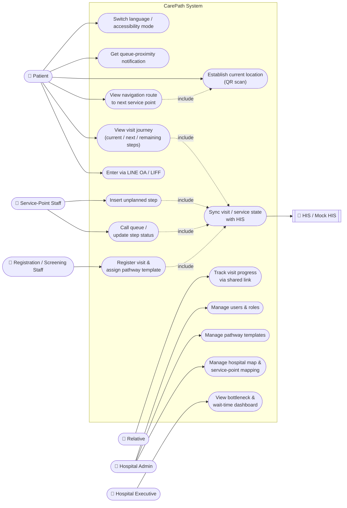

# Use Case Diagram

Actors and use cases for CarePath, covering the full brief scope (Must/Should/Could — see [Functional Requirements](functional-requirements.md) and [User Stories](user-stories.md)). Mermaid has no native UML use-case notation, so actors are drawn as boxes and use cases as pill shapes inside the system boundary; `include` edges show a hard dependency between use cases.

## Notes

- **Authentication & role-based access (FR-18)** applies across every staff/admin/executive use case (UC8–UC14) and is omitted from the diagram as an edge to avoid clutter — treat it as a precondition of the system boundary, not a separate use case.
- **UC15 (Sync visit/service state with HIS)** is the canonical event/command boundary defined in [ADR-0008](../adr/0008-his-canonical-event-contract.md): the HIS remains the system of record for visit/step status, and CarePath actions (registration, queue call, step completion, unplanned-step insertion) are forwarded as commands rather than written directly.
- **UC3 includes UC4** because route calculation needs a resolved starting point; when no QR scan has happened yet, the patient falls back to manual location selection (see [ADR-0004](../adr/0004-location-provider-abstraction.md)).

## Actor → use case → requirement traceability

| Actor | Use case | User story | Functional requirement |
|---|---|---|---|
| Patient | UC1 Enter via LINE OA/LIFF | [US-01](user-stories.md#us-01-open-carepath-from-line--must-m4) | FR-01 |
| Patient | UC2 View visit journey | [US-02](user-stories.md#us-02-see-my-current-and-next-step--must-m4) | FR-02, FR-03 |
| Patient | UC3 View navigation route | [US-03](user-stories.md#us-03-navigate-to-the-next-service--must-m5-m6) | FR-04, FR-05, FR-07, FR-08 |
| Patient | UC4 Establish current location | [US-04](user-stories.md#us-04-establish-my-current-location--should-s2) | FR-06 |
| Patient | UC5 Queue-proximity notification | [US-10](user-stories.md#us-10-get-notified-before-my-queue-comes-up--should-s6) | FR-21 |
| Patient | UC6 Switch language / accessibility | [US-09](user-stories.md#us-09-get-an-accessible-route--should-s5), [US-11](user-stories.md#us-11-use-carepath-in-my-own-language--should-s4) | FR-19, FR-20 |
| Relative | UC7 Track visit progress | [US-12](user-stories.md#us-12-track-a-patients-progress-remotely--could-c2) | FR-24 |
| Registration/screening staff | UC8 Register visit & assign template | [US-13](user-stories.md#us-13-register-a-visit-and-assign-a-pathway-template--must-m3) | FR-14 |
| Service-point staff | UC9 Call queue / update step status | [US-14](user-stories.md#us-14-call-the-queue-and-record-step-completion--must-m7) | FR-15, FR-17 |
| Service-point staff | UC10 Insert unplanned step | [US-15](user-stories.md#us-15-insert-an-unplanned-step--must-m7) | FR-16 |
| Hospital admin | UC11 Manage hospital map & service points | [US-05](user-stories.md#us-05-configure-service-point-mapping--must-m1), [US-06](user-stories.md#us-06-update-floornavigation-data--must-m1-m6) | FR-05, FR-11 |
| Hospital admin | UC12 Manage pathway templates | [US-16](user-stories.md#us-16-create-and-edit-care-pathway-templates--must-m2) | FR-13 |
| Hospital admin | UC13 Manage users & roles | [US-17](user-stories.md#us-17-manage-user-roles-and-access--must-m8) | FR-18 |
| Hospital executive | UC14 View bottleneck & wait-time dashboard | [US-18](user-stories.md#us-18-view-bottlenecks-and-average-wait-time--should-s7) | FR-22 |
| System (HIS integration) | UC15 Sync visit/service state with HIS | [US-07](user-stories.md#us-07-develop-without-a-production-his--must-supports-m3m7), [US-08](user-stories.md#us-08-replace-mock-his-with-a-real-adapter--non-functional-maintainability) | FR-09, FR-10 |
